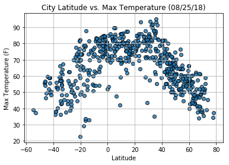
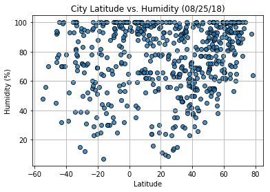
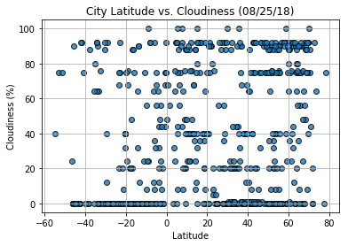
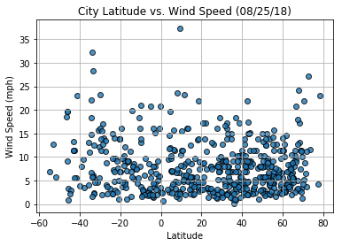

Analysis:

Right now, the highest temperatures are between 0 and 40 degrees.

It is more humid north of the Equator, between 20-60 degrees. It is the least humid between -60 to -40 degrees.

The highest concentration of clouds (90%) are 40-80 degrees north of the equator, which almost correlates with the higher humidity locations. 

Right now, there's very little wind in majority of the cities. Most of the wind speeds are below 15 mph in all latitude regions.


```python
# Dependencies and Setup
# https://docs.python.org/3/library/urllib.request.html#module-urllib.request
import matplotlib.pyplot as plt
import pandas as pd
import numpy as np
import requests
import time
import urllib

# Incorporated citipy to determine city based on latitude and longitude
from citipy import citipy

# Import API key
import api_keys

# Output File (CSV)
output_data_file = "output_data/cities.csv"

# Range of latitudes and longitudes
lat_range = (-90, 90)
long_range = (-180, 180)
```

## Generate Cities List


```python
# List for holding lat_longs and cities
lat_lngs = []
cities = []

# Random lat and long combinations
lats = np.random.uniform(low=-90.000, high=90.000, size=1500)
lngs = np.random.uniform(low=-180.000, high=180.000, size=1500)
lat_lngs = zip(lats, lngs)

# Identify nearest city for each lat, lng combination
for lat_lng in lat_lngs:
    city = citipy.nearest_city(lat_lng[0], lat_lng[1]).city_name
    
    # If the city is unique, then add it to a our cities list
    if city not in cities:
        cities.append(city)

# Print the city count to confirm sufficient count
len(cities)
```


    605


## Perform API Calls


```python
# OpenWeatherMap API Key
api_key = api_keys.api_key

# Starting URL for Weather Map API Call
url = "http://api.openweathermap.org/data/2.5/weather?units=Imperial&APPID=" + api_key 

# List of city data
city_data = []

# Print to logger
print("Beginning Data Retrieval     ")
print("-----------------------------")

# Create counters
record_count = 1
set_count = 1

# Loop through all the cities in our list
for i, city in enumerate(cities):
        
    # Group cities in sets of 50 for logging purposes
    if (i % 50 == 0 and i >= 50):
        set_count += 1
        record_count = 0

    # Create endpoint URL with each city
    city_url = url + "&q=" + urllib.request.pathname2url(city)
    

    # Log the url, record, and set numbers
    print("Processing Record %s of Set %s | %s" % (record_count, set_count, city))
    print(city_url)

    # Add 1 to the record count
    record_count += 1

    # Run an API request for each of the cities
    try:
        # Parse the JSON and retrieve data
        city_weather = requests.get(city_url).json()

        # Parse out the max temp, humidity, and cloudiness
        city_lat = city_weather["coord"]["lat"]
        city_lng = city_weather["coord"]["lon"]
        city_max_temp = city_weather["main"]["temp_max"]
        city_humidity = city_weather["main"]["humidity"]
        city_clouds = city_weather["clouds"]["all"]
        city_wind = city_weather["wind"]["speed"]
        city_country = city_weather["sys"]["country"]
        city_date = city_weather["dt"]

        # Append the City information into city_data list
        city_data.append({"City": city, 
                          "Lat": city_lat, 
                          "Long": city_lng, 
                          "Max Temp": city_max_temp,
                          "Humidity": city_humidity,
                          "Cloudiness": city_clouds,
                          "Wind Speed": city_wind,
                          "Country": city_country,
                          "Date": city_date})

    # If an error is experienced, skip the city
    except:
        print("City not found. Skipping...")
        pass
              
# Indicate that Data Loading is complete 
print("-----------------------------")
print("Data Retrieval Complete      ")
print("-----------------------------")


```

    Beginning Data Retrieval     
    -----------------------------
    Processing Record 1 of Set 1 | namibe
    http://api.openweathermap.org/data/2.5/weather?units=Imperial&APPID=5b6593e05daebb23edc980b83d7543d7&q=namibe
    Processing Record 2 of Set 1 | meulaboh
    http://api.openweathermap.org/data/2.5/weather?units=Imperial&APPID=5b6593e05daebb23edc980b83d7543d7&q=meulaboh
    Processing Record 3 of Set 1 | clyde river
    http://api.openweathermap.org/data/2.5/weather?units=Imperial&APPID=5b6593e05daebb23edc980b83d7543d7&q=clyde%20river
    Processing Record 4 of Set 1 | estelle
    http://api.openweathermap.org/data/2.5/weather?units=Imperial&APPID=5b6593e05daebb23edc980b83d7543d7&q=estelle
    Processing Record 5 of Set 1 | port lincoln
    http://api.openweathermap.org/data/2.5/weather?units=Imperial&APPID=5b6593e05daebb23edc980b83d7543d7&q=port%20lincoln
    Processing Record 6 of Set 1 | esperance
    http://api.openweathermap.org/data/2.5/weather?units=Imperial&APPID=5b6593e05daebb23edc980b83d7543d7&q=esperance
    Processing Record 7 of Set 1 | tiksi
    http://api.openweathermap.org/data/2.5/weather?units=Imperial&APPID=5b6593e05daebb23edc980b83d7543d7&q=tiksi
    Processing Record 8 of Set 1 | nikolskoye
    http://api.openweathermap.org/data/2.5/weather?units=Imperial&APPID=5b6593e05daebb23edc980b83d7543d7&q=nikolskoye
    Processing Record 9 of Set 1 | amderma
    http://api.openweathermap.org/data/2.5/weather?units=Imperial&APPID=5b6593e05daebb23edc980b83d7543d7&q=amderma
    City not found. Skipping...
    Processing Record 10 of Set 1 | khatanga
    http://api.openweathermap.org/data/2.5/weather?units=Imperial&APPID=5b6593e05daebb23edc980b83d7543d7&q=khatanga
    Processing Record 11 of Set 1 | ponta do sol
    http://api.openweathermap.org/data/2.5/weather?units=Imperial&APPID=5b6593e05daebb23edc980b83d7543d7&q=ponta%20do%20sol
    Processing Record 12 of Set 1 | rikitea
    http://api.openweathermap.org/data/2.5/weather?units=Imperial&APPID=5b6593e05daebb23edc980b83d7543d7&q=rikitea
    Processing Record 13 of Set 1 | roma
    http://api.openweathermap.org/data/2.5/weather?units=Imperial&APPID=5b6593e05daebb23edc980b83d7543d7&q=roma
    Processing Record 14 of Set 1 | barbar
    http://api.openweathermap.org/data/2.5/weather?units=Imperial&APPID=5b6593e05daebb23edc980b83d7543d7&q=barbar
    City not found. Skipping...
    Processing Record 15 of Set 1 | taolanaro
    http://api.openweathermap.org/data/2.5/weather?units=Imperial&APPID=5b6593e05daebb23edc980b83d7543d7&q=taolanaro
    City not found. Skipping...
    Processing Record 16 of Set 1 | diu
    http://api.openweathermap.org/data/2.5/weather?units=Imperial&APPID=5b6593e05daebb23edc980b83d7543d7&q=diu
    Processing Record 17 of Set 1 | mount gambier
    http://api.openweathermap.org/data/2.5/weather?units=Imperial&APPID=5b6593e05daebb23edc980b83d7543d7&q=mount%20gambier
    Processing Record 18 of Set 1 | barrow
    http://api.openweathermap.org/data/2.5/weather?units=Imperial&APPID=5b6593e05daebb23edc980b83d7543d7&q=barrow
    Processing Record 19 of Set 1 | mizdah
    http://api.openweathermap.org/data/2.5/weather?units=Imperial&APPID=5b6593e05daebb23edc980b83d7543d7&q=mizdah
    Processing Record 20 of Set 1 | yuzhno-yeniseyskiy
    http://api.openweathermap.org/data/2.5/weather?units=Imperial&APPID=5b6593e05daebb23edc980b83d7543d7&q=yuzhno-yeniseyskiy
    City not found. Skipping...
    Processing Record 21 of Set 1 | san policarpo
    http://api.openweathermap.org/data/2.5/weather?units=Imperial&APPID=5b6593e05daebb23edc980b83d7543d7&q=san%20policarpo
    Processing Record 22 of Set 1 | bontang
    http://api.openweathermap.org/data/2.5/weather?units=Imperial&APPID=5b6593e05daebb23edc980b83d7543d7&q=bontang
    Processing Record 23 of Set 1 | kapaa
    http://api.openweathermap.org/data/2.5/weather?units=Imperial&APPID=5b6593e05daebb23edc980b83d7543d7&q=kapaa
    Processing Record 24 of Set 1 | husavik
    http://api.openweathermap.org/data/2.5/weather?units=Imperial&APPID=5b6593e05daebb23edc980b83d7543d7&q=husavik
    Processing Record 25 of Set 1 | tarakan
    http://api.openweathermap.org/data/2.5/weather?units=Imperial&APPID=5b6593e05daebb23edc980b83d7543d7&q=tarakan
    Processing Record 26 of Set 1 | ushuaia
    http://api.openweathermap.org/data/2.5/weather?units=Imperial&APPID=5b6593e05daebb23edc980b83d7543d7&q=ushuaia
    Processing Record 27 of Set 1 | palabuhanratu
    http://api.openweathermap.org/data/2.5/weather?units=Imperial&APPID=5b6593e05daebb23edc980b83d7543d7&q=palabuhanratu
    City not found. Skipping...
    Processing Record 28 of Set 1 | new norfolk
    http://api.openweathermap.org/data/2.5/weather?units=Imperial&APPID=5b6593e05daebb23edc980b83d7543d7&q=new%20norfolk
    Processing Record 29 of Set 1 | lunino
    http://api.openweathermap.org/data/2.5/weather?units=Imperial&APPID=5b6593e05daebb23edc980b83d7543d7&q=lunino
    Processing Record 30 of Set 1 | hermanus
    http://api.openweathermap.org/data/2.5/weather?units=Imperial&APPID=5b6593e05daebb23edc980b83d7543d7&q=hermanus
    Processing Record 31 of Set 1 | mount pleasant
    http://api.openweathermap.org/data/2.5/weather?units=Imperial&APPID=5b6593e05daebb23edc980b83d7543d7&q=mount%20pleasant
    Processing Record 32 of Set 1 | arraial do cabo
    http://api.openweathermap.org/data/2.5/weather?units=Imperial&APPID=5b6593e05daebb23edc980b83d7543d7&q=arraial%20do%20cabo
    Processing Record 33 of Set 1 | hilo
    http://api.openweathermap.org/data/2.5/weather?units=Imperial&APPID=5b6593e05daebb23edc980b83d7543d7&q=hilo
    Processing Record 34 of Set 1 | albany
    http://api.openweathermap.org/data/2.5/weather?units=Imperial&APPID=5b6593e05daebb23edc980b83d7543d7&q=albany
    Processing Record 35 of Set 1 | qaanaaq
    http://api.openweathermap.org/data/2.5/weather?units=Imperial&APPID=5b6593e05daebb23edc980b83d7543d7&q=qaanaaq
    Processing Record 36 of Set 1 | toliary
    http://api.openweathermap.org/data/2.5/weather?units=Imperial&APPID=5b6593e05daebb23edc980b83d7543d7&q=toliary
    City not found. Skipping...
    Processing Record 37 of Set 1 | saquena
    http://api.openweathermap.org/data/2.5/weather?units=Imperial&APPID=5b6593e05daebb23edc980b83d7543d7&q=saquena
    Processing Record 38 of Set 1 | longyearbyen
    http://api.openweathermap.org/data/2.5/weather?units=Imperial&APPID=5b6593e05daebb23edc980b83d7543d7&q=longyearbyen
    Processing Record 39 of Set 1 | mahebourg
    http://api.openweathermap.org/data/2.5/weather?units=Imperial&APPID=5b6593e05daebb23edc980b83d7543d7&q=mahebourg
    Processing Record 40 of Set 1 | taltal
    http://api.openweathermap.org/data/2.5/weather?units=Imperial&APPID=5b6593e05daebb23edc980b83d7543d7&q=taltal
    Processing Record 41 of Set 1 | barentsburg
    http://api.openweathermap.org/data/2.5/weather?units=Imperial&APPID=5b6593e05daebb23edc980b83d7543d7&q=barentsburg
    City not found. Skipping...
    Processing Record 42 of Set 1 | puerto ayora
    http://api.openweathermap.org/data/2.5/weather?units=Imperial&APPID=5b6593e05daebb23edc980b83d7543d7&q=puerto%20ayora
    Processing Record 43 of Set 1 | tanhacu
    http://api.openweathermap.org/data/2.5/weather?units=Imperial&APPID=5b6593e05daebb23edc980b83d7543d7&q=tanhacu
    Processing Record 44 of Set 1 | port elizabeth
    http://api.openweathermap.org/data/2.5/weather?units=Imperial&APPID=5b6593e05daebb23edc980b83d7543d7&q=port%20elizabeth
    Processing Record 45 of Set 1 | cabo san lucas
    http://api.openweathermap.org/data/2.5/weather?units=Imperial&APPID=5b6593e05daebb23edc980b83d7543d7&q=cabo%20san%20lucas
    Processing Record 46 of Set 1 | herat
    http://api.openweathermap.org/data/2.5/weather?units=Imperial&APPID=5b6593e05daebb23edc980b83d7543d7&q=herat
    Processing Record 47 of Set 1 | egvekinot
    http://api.openweathermap.org/data/2.5/weather?units=Imperial&APPID=5b6593e05daebb23edc980b83d7543d7&q=egvekinot
    Processing Record 48 of Set 1 | roanoke rapids
    http://api.openweathermap.org/data/2.5/weather?units=Imperial&APPID=5b6593e05daebb23edc980b83d7543d7&q=roanoke%20rapids
    Processing Record 49 of Set 1 | vaini
    http://api.openweathermap.org/data/2.5/weather?units=Imperial&APPID=5b6593e05daebb23edc980b83d7543d7&q=vaini
    Processing Record 50 of Set 1 | saint-philippe
    http://api.openweathermap.org/data/2.5/weather?units=Imperial&APPID=5b6593e05daebb23edc980b83d7543d7&q=saint-philippe
    Processing Record 0 of Set 2 | aitape
    http://api.openweathermap.org/data/2.5/weather?units=Imperial&APPID=5b6593e05daebb23edc980b83d7543d7&q=aitape
    Processing Record 1 of Set 2 | jamestown
    http://api.openweathermap.org/data/2.5/weather?units=Imperial&APPID=5b6593e05daebb23edc980b83d7543d7&q=jamestown
    Processing Record 2 of Set 2 | vesele
    http://api.openweathermap.org/data/2.5/weather?units=Imperial&APPID=5b6593e05daebb23edc980b83d7543d7&q=vesele
    Processing Record 3 of Set 2 | ipixuna
    http://api.openweathermap.org/data/2.5/weather?units=Imperial&APPID=5b6593e05daebb23edc980b83d7543d7&q=ipixuna
    Processing Record 4 of Set 2 | mar del plata
    http://api.openweathermap.org/data/2.5/weather?units=Imperial&APPID=5b6593e05daebb23edc980b83d7543d7&q=mar%20del%20plata
    Processing Record 5 of Set 2 | martapura
    http://api.openweathermap.org/data/2.5/weather?units=Imperial&APPID=5b6593e05daebb23edc980b83d7543d7&q=martapura
    Processing Record 6 of Set 2 | novooleksiyivka
    http://api.openweathermap.org/data/2.5/weather?units=Imperial&APPID=5b6593e05daebb23edc980b83d7543d7&q=novooleksiyivka
    Processing Record 7 of Set 2 | peterhead
    http://api.openweathermap.org/data/2.5/weather?units=Imperial&APPID=5b6593e05daebb23edc980b83d7543d7&q=peterhead
    Processing Record 8 of Set 2 | nicoya
    http://api.openweathermap.org/data/2.5/weather?units=Imperial&APPID=5b6593e05daebb23edc980b83d7543d7&q=nicoya
    Processing Record 9 of Set 2 | ambon
    http://api.openweathermap.org/data/2.5/weather?units=Imperial&APPID=5b6593e05daebb23edc980b83d7543d7&q=ambon
    Processing Record 10 of Set 2 | mount isa
    http://api.openweathermap.org/data/2.5/weather?units=Imperial&APPID=5b6593e05daebb23edc980b83d7543d7&q=mount%20isa
    Processing Record 11 of Set 2 | houffalize
    http://api.openweathermap.org/data/2.5/weather?units=Imperial&APPID=5b6593e05daebb23edc980b83d7543d7&q=houffalize
    Processing Record 12 of Set 2 | santa maria
    http://api.openweathermap.org/data/2.5/weather?units=Imperial&APPID=5b6593e05daebb23edc980b83d7543d7&q=santa%20maria
    Processing Record 13 of Set 2 | sept-iles
    http://api.openweathermap.org/data/2.5/weather?units=Imperial&APPID=5b6593e05daebb23edc980b83d7543d7&q=sept-iles
    Processing Record 14 of Set 2 | geraldton
    http://api.openweathermap.org/data/2.5/weather?units=Imperial&APPID=5b6593e05daebb23edc980b83d7543d7&q=geraldton
    Processing Record 15 of Set 2 | sorong
    http://api.openweathermap.org/data/2.5/weather?units=Imperial&APPID=5b6593e05daebb23edc980b83d7543d7&q=sorong
    Processing Record 16 of Set 2 | east london
    http://api.openweathermap.org/data/2.5/weather?units=Imperial&APPID=5b6593e05daebb23edc980b83d7543d7&q=east%20london
    Processing Record 17 of Set 2 | nanortalik
    http://api.openweathermap.org/data/2.5/weather?units=Imperial&APPID=5b6593e05daebb23edc980b83d7543d7&q=nanortalik
    Processing Record 18 of Set 2 | adrar
    http://api.openweathermap.org/data/2.5/weather?units=Imperial&APPID=5b6593e05daebb23edc980b83d7543d7&q=adrar
    Processing Record 19 of Set 2 | charleston
    http://api.openweathermap.org/data/2.5/weather?units=Imperial&APPID=5b6593e05daebb23edc980b83d7543d7&q=charleston
    Processing Record 20 of Set 2 | dikson
    http://api.openweathermap.org/data/2.5/weather?units=Imperial&APPID=5b6593e05daebb23edc980b83d7543d7&q=dikson
    Processing Record 21 of Set 2 | karkaralinsk
    http://api.openweathermap.org/data/2.5/weather?units=Imperial&APPID=5b6593e05daebb23edc980b83d7543d7&q=karkaralinsk
    City not found. Skipping...
    Processing Record 22 of Set 2 | castelldefels
    http://api.openweathermap.org/data/2.5/weather?units=Imperial&APPID=5b6593e05daebb23edc980b83d7543d7&q=castelldefels
    Processing Record 23 of Set 2 | busselton
    http://api.openweathermap.org/data/2.5/weather?units=Imperial&APPID=5b6593e05daebb23edc980b83d7543d7&q=busselton
    Processing Record 24 of Set 2 | lebu
    http://api.openweathermap.org/data/2.5/weather?units=Imperial&APPID=5b6593e05daebb23edc980b83d7543d7&q=lebu
    Processing Record 25 of Set 2 | buraydah
    http://api.openweathermap.org/data/2.5/weather?units=Imperial&APPID=5b6593e05daebb23edc980b83d7543d7&q=buraydah
    Processing Record 26 of Set 2 | kruisfontein
    http://api.openweathermap.org/data/2.5/weather?units=Imperial&APPID=5b6593e05daebb23edc980b83d7543d7&q=kruisfontein
    Processing Record 27 of Set 2 | contamana
    http://api.openweathermap.org/data/2.5/weather?units=Imperial&APPID=5b6593e05daebb23edc980b83d7543d7&q=contamana
    Processing Record 28 of Set 2 | lolua
    http://api.openweathermap.org/data/2.5/weather?units=Imperial&APPID=5b6593e05daebb23edc980b83d7543d7&q=lolua
    City not found. Skipping...
    Processing Record 29 of Set 2 | kropotkin
    http://api.openweathermap.org/data/2.5/weather?units=Imperial&APPID=5b6593e05daebb23edc980b83d7543d7&q=kropotkin
    Processing Record 30 of Set 2 | ribeira grande
    http://api.openweathermap.org/data/2.5/weather?units=Imperial&APPID=5b6593e05daebb23edc980b83d7543d7&q=ribeira%20grande
    Processing Record 31 of Set 2 | belushya guba
    http://api.openweathermap.org/data/2.5/weather?units=Imperial&APPID=5b6593e05daebb23edc980b83d7543d7&q=belushya%20guba
    City not found. Skipping...
    Processing Record 32 of Set 2 | vardo
    http://api.openweathermap.org/data/2.5/weather?units=Imperial&APPID=5b6593e05daebb23edc980b83d7543d7&q=vardo
    Processing Record 33 of Set 2 | cape town
    http://api.openweathermap.org/data/2.5/weather?units=Imperial&APPID=5b6593e05daebb23edc980b83d7543d7&q=cape%20town
    Processing Record 34 of Set 2 | hinton
    http://api.openweathermap.org/data/2.5/weather?units=Imperial&APPID=5b6593e05daebb23edc980b83d7543d7&q=hinton
    Processing Record 35 of Set 2 | berdigestyakh
    http://api.openweathermap.org/data/2.5/weather?units=Imperial&APPID=5b6593e05daebb23edc980b83d7543d7&q=berdigestyakh
    Processing Record 36 of Set 2 | la ferte-bernard
    http://api.openweathermap.org/data/2.5/weather?units=Imperial&APPID=5b6593e05daebb23edc980b83d7543d7&q=la%20ferte-bernard
    Processing Record 37 of Set 2 | mataura
    http://api.openweathermap.org/data/2.5/weather?units=Imperial&APPID=5b6593e05daebb23edc980b83d7543d7&q=mataura
    Processing Record 38 of Set 2 | hasaki
    http://api.openweathermap.org/data/2.5/weather?units=Imperial&APPID=5b6593e05daebb23edc980b83d7543d7&q=hasaki
    Processing Record 39 of Set 2 | bathsheba
    http://api.openweathermap.org/data/2.5/weather?units=Imperial&APPID=5b6593e05daebb23edc980b83d7543d7&q=bathsheba
    Processing Record 40 of Set 2 | punta arenas
    http://api.openweathermap.org/data/2.5/weather?units=Imperial&APPID=5b6593e05daebb23edc980b83d7543d7&q=punta%20arenas
    Processing Record 41 of Set 2 | carnarvon
    http://api.openweathermap.org/data/2.5/weather?units=Imperial&APPID=5b6593e05daebb23edc980b83d7543d7&q=carnarvon
    Processing Record 42 of Set 2 | roald
    http://api.openweathermap.org/data/2.5/weather?units=Imperial&APPID=5b6593e05daebb23edc980b83d7543d7&q=roald
    Processing Record 43 of Set 2 | tual
    http://api.openweathermap.org/data/2.5/weather?units=Imperial&APPID=5b6593e05daebb23edc980b83d7543d7&q=tual
    Processing Record 44 of Set 2 | alofi
    http://api.openweathermap.org/data/2.5/weather?units=Imperial&APPID=5b6593e05daebb23edc980b83d7543d7&q=alofi
    Processing Record 45 of Set 2 | lorengau
    http://api.openweathermap.org/data/2.5/weather?units=Imperial&APPID=5b6593e05daebb23edc980b83d7543d7&q=lorengau
    Processing Record 46 of Set 2 | petropavlovsk-kamchatskiy
    http://api.openweathermap.org/data/2.5/weather?units=Imperial&APPID=5b6593e05daebb23edc980b83d7543d7&q=petropavlovsk-kamchatskiy
    Processing Record 47 of Set 2 | fos-sur-mer
    http://api.openweathermap.org/data/2.5/weather?units=Imperial&APPID=5b6593e05daebb23edc980b83d7543d7&q=fos-sur-mer
    Processing Record 48 of Set 2 | illoqqortoormiut
    http://api.openweathermap.org/data/2.5/weather?units=Imperial&APPID=5b6593e05daebb23edc980b83d7543d7&q=illoqqortoormiut
    City not found. Skipping...
    Processing Record 49 of Set 2 | samusu
    http://api.openweathermap.org/data/2.5/weather?units=Imperial&APPID=5b6593e05daebb23edc980b83d7543d7&q=samusu
    City not found. Skipping...
    Processing Record 0 of Set 3 | bethel
    http://api.openweathermap.org/data/2.5/weather?units=Imperial&APPID=5b6593e05daebb23edc980b83d7543d7&q=bethel
    Processing Record 1 of Set 3 | rungata
    http://api.openweathermap.org/data/2.5/weather?units=Imperial&APPID=5b6593e05daebb23edc980b83d7543d7&q=rungata
    City not found. Skipping...
    Processing Record 2 of Set 3 | kaitangata
    http://api.openweathermap.org/data/2.5/weather?units=Imperial&APPID=5b6593e05daebb23edc980b83d7543d7&q=kaitangata
    Processing Record 3 of Set 3 | kavaratti
    http://api.openweathermap.org/data/2.5/weather?units=Imperial&APPID=5b6593e05daebb23edc980b83d7543d7&q=kavaratti
    Processing Record 4 of Set 3 | kutum
    http://api.openweathermap.org/data/2.5/weather?units=Imperial&APPID=5b6593e05daebb23edc980b83d7543d7&q=kutum
    Processing Record 5 of Set 3 | saint george
    http://api.openweathermap.org/data/2.5/weather?units=Imperial&APPID=5b6593e05daebb23edc980b83d7543d7&q=saint%20george
    Processing Record 6 of Set 3 | bull savanna
    http://api.openweathermap.org/data/2.5/weather?units=Imperial&APPID=5b6593e05daebb23edc980b83d7543d7&q=bull%20savanna
    Processing Record 7 of Set 3 | avarua
    http://api.openweathermap.org/data/2.5/weather?units=Imperial&APPID=5b6593e05daebb23edc980b83d7543d7&q=avarua
    Processing Record 8 of Set 3 | chokurdakh
    http://api.openweathermap.org/data/2.5/weather?units=Imperial&APPID=5b6593e05daebb23edc980b83d7543d7&q=chokurdakh
    Processing Record 9 of Set 3 | non sang
    http://api.openweathermap.org/data/2.5/weather?units=Imperial&APPID=5b6593e05daebb23edc980b83d7543d7&q=non%20sang
    Processing Record 10 of Set 3 | shimoda
    http://api.openweathermap.org/data/2.5/weather?units=Imperial&APPID=5b6593e05daebb23edc980b83d7543d7&q=shimoda
    Processing Record 11 of Set 3 | saint anthony
    http://api.openweathermap.org/data/2.5/weather?units=Imperial&APPID=5b6593e05daebb23edc980b83d7543d7&q=saint%20anthony
    Processing Record 12 of Set 3 | teguise
    http://api.openweathermap.org/data/2.5/weather?units=Imperial&APPID=5b6593e05daebb23edc980b83d7543d7&q=teguise
    Processing Record 13 of Set 3 | jalingo
    http://api.openweathermap.org/data/2.5/weather?units=Imperial&APPID=5b6593e05daebb23edc980b83d7543d7&q=jalingo
    Processing Record 14 of Set 3 | jacareacanga
    http://api.openweathermap.org/data/2.5/weather?units=Imperial&APPID=5b6593e05daebb23edc980b83d7543d7&q=jacareacanga
    Processing Record 15 of Set 3 | byron bay
    http://api.openweathermap.org/data/2.5/weather?units=Imperial&APPID=5b6593e05daebb23edc980b83d7543d7&q=byron%20bay
    Processing Record 16 of Set 3 | wexford
    http://api.openweathermap.org/data/2.5/weather?units=Imperial&APPID=5b6593e05daebb23edc980b83d7543d7&q=wexford
    Processing Record 17 of Set 3 | khorramshahr
    http://api.openweathermap.org/data/2.5/weather?units=Imperial&APPID=5b6593e05daebb23edc980b83d7543d7&q=khorramshahr
    Processing Record 18 of Set 3 | san patricio
    http://api.openweathermap.org/data/2.5/weather?units=Imperial&APPID=5b6593e05daebb23edc980b83d7543d7&q=san%20patricio
    Processing Record 19 of Set 3 | mys shmidta
    http://api.openweathermap.org/data/2.5/weather?units=Imperial&APPID=5b6593e05daebb23edc980b83d7543d7&q=mys%20shmidta
    City not found. Skipping...
    Processing Record 20 of Set 3 | hualmay
    http://api.openweathermap.org/data/2.5/weather?units=Imperial&APPID=5b6593e05daebb23edc980b83d7543d7&q=hualmay
    Processing Record 21 of Set 3 | gat
    http://api.openweathermap.org/data/2.5/weather?units=Imperial&APPID=5b6593e05daebb23edc980b83d7543d7&q=gat
    Processing Record 22 of Set 3 | nador
    http://api.openweathermap.org/data/2.5/weather?units=Imperial&APPID=5b6593e05daebb23edc980b83d7543d7&q=nador
    Processing Record 23 of Set 3 | bluff
    http://api.openweathermap.org/data/2.5/weather?units=Imperial&APPID=5b6593e05daebb23edc980b83d7543d7&q=bluff
    Processing Record 24 of Set 3 | narsaq
    http://api.openweathermap.org/data/2.5/weather?units=Imperial&APPID=5b6593e05daebb23edc980b83d7543d7&q=narsaq
    Processing Record 25 of Set 3 | bekes
    http://api.openweathermap.org/data/2.5/weather?units=Imperial&APPID=5b6593e05daebb23edc980b83d7543d7&q=bekes
    Processing Record 26 of Set 3 | kaspiyskiy
    http://api.openweathermap.org/data/2.5/weather?units=Imperial&APPID=5b6593e05daebb23edc980b83d7543d7&q=kaspiyskiy
    Processing Record 27 of Set 3 | morondava
    http://api.openweathermap.org/data/2.5/weather?units=Imperial&APPID=5b6593e05daebb23edc980b83d7543d7&q=morondava
    Processing Record 28 of Set 3 | san cristobal
    http://api.openweathermap.org/data/2.5/weather?units=Imperial&APPID=5b6593e05daebb23edc980b83d7543d7&q=san%20cristobal
    Processing Record 29 of Set 3 | dryden
    http://api.openweathermap.org/data/2.5/weather?units=Imperial&APPID=5b6593e05daebb23edc980b83d7543d7&q=dryden
    Processing Record 30 of Set 3 | birao
    http://api.openweathermap.org/data/2.5/weather?units=Imperial&APPID=5b6593e05daebb23edc980b83d7543d7&q=birao
    Processing Record 31 of Set 3 | brandon
    http://api.openweathermap.org/data/2.5/weather?units=Imperial&APPID=5b6593e05daebb23edc980b83d7543d7&q=brandon
    Processing Record 32 of Set 3 | puerto el triunfo
    http://api.openweathermap.org/data/2.5/weather?units=Imperial&APPID=5b6593e05daebb23edc980b83d7543d7&q=puerto%20el%20triunfo
    Processing Record 33 of Set 3 | stepnyak
    http://api.openweathermap.org/data/2.5/weather?units=Imperial&APPID=5b6593e05daebb23edc980b83d7543d7&q=stepnyak
    Processing Record 34 of Set 3 | insar
    http://api.openweathermap.org/data/2.5/weather?units=Imperial&APPID=5b6593e05daebb23edc980b83d7543d7&q=insar
    Processing Record 35 of Set 3 | butaritari
    http://api.openweathermap.org/data/2.5/weather?units=Imperial&APPID=5b6593e05daebb23edc980b83d7543d7&q=butaritari
    Processing Record 36 of Set 3 | luwuk
    http://api.openweathermap.org/data/2.5/weather?units=Imperial&APPID=5b6593e05daebb23edc980b83d7543d7&q=luwuk
    Processing Record 37 of Set 3 | campo verde
    http://api.openweathermap.org/data/2.5/weather?units=Imperial&APPID=5b6593e05daebb23edc980b83d7543d7&q=campo%20verde
    Processing Record 38 of Set 3 | torbay
    http://api.openweathermap.org/data/2.5/weather?units=Imperial&APPID=5b6593e05daebb23edc980b83d7543d7&q=torbay
    Processing Record 39 of Set 3 | sabang
    http://api.openweathermap.org/data/2.5/weather?units=Imperial&APPID=5b6593e05daebb23edc980b83d7543d7&q=sabang
    Processing Record 40 of Set 3 | bredasdorp
    http://api.openweathermap.org/data/2.5/weather?units=Imperial&APPID=5b6593e05daebb23edc980b83d7543d7&q=bredasdorp
    Processing Record 41 of Set 3 | nome
    http://api.openweathermap.org/data/2.5/weather?units=Imperial&APPID=5b6593e05daebb23edc980b83d7543d7&q=nome
    Processing Record 42 of Set 3 | mitu
    http://api.openweathermap.org/data/2.5/weather?units=Imperial&APPID=5b6593e05daebb23edc980b83d7543d7&q=mitu
    Processing Record 43 of Set 3 | khor
    http://api.openweathermap.org/data/2.5/weather?units=Imperial&APPID=5b6593e05daebb23edc980b83d7543d7&q=khor
    Processing Record 44 of Set 3 | cidreira
    http://api.openweathermap.org/data/2.5/weather?units=Imperial&APPID=5b6593e05daebb23edc980b83d7543d7&q=cidreira
    Processing Record 45 of Set 3 | dingle
    http://api.openweathermap.org/data/2.5/weather?units=Imperial&APPID=5b6593e05daebb23edc980b83d7543d7&q=dingle
    Processing Record 46 of Set 3 | pointe michel
    http://api.openweathermap.org/data/2.5/weather?units=Imperial&APPID=5b6593e05daebb23edc980b83d7543d7&q=pointe%20michel
    Processing Record 47 of Set 3 | tsihombe
    http://api.openweathermap.org/data/2.5/weather?units=Imperial&APPID=5b6593e05daebb23edc980b83d7543d7&q=tsihombe
    City not found. Skipping...
    Processing Record 48 of Set 3 | altonia
    http://api.openweathermap.org/data/2.5/weather?units=Imperial&APPID=5b6593e05daebb23edc980b83d7543d7&q=altonia
    City not found. Skipping...
    Processing Record 49 of Set 3 | saldanha
    http://api.openweathermap.org/data/2.5/weather?units=Imperial&APPID=5b6593e05daebb23edc980b83d7543d7&q=saldanha
    Processing Record 0 of Set 4 | rodeo
    http://api.openweathermap.org/data/2.5/weather?units=Imperial&APPID=5b6593e05daebb23edc980b83d7543d7&q=rodeo
    Processing Record 1 of Set 4 | taburi
    http://api.openweathermap.org/data/2.5/weather?units=Imperial&APPID=5b6593e05daebb23edc980b83d7543d7&q=taburi
    City not found. Skipping...
    Processing Record 2 of Set 4 | sorvag
    http://api.openweathermap.org/data/2.5/weather?units=Imperial&APPID=5b6593e05daebb23edc980b83d7543d7&q=sorvag
    City not found. Skipping...
    Processing Record 3 of Set 4 | quelimane
    http://api.openweathermap.org/data/2.5/weather?units=Imperial&APPID=5b6593e05daebb23edc980b83d7543d7&q=quelimane
    Processing Record 4 of Set 4 | polunochnoye
    http://api.openweathermap.org/data/2.5/weather?units=Imperial&APPID=5b6593e05daebb23edc980b83d7543d7&q=polunochnoye
    Processing Record 5 of Set 4 | belyy yar
    http://api.openweathermap.org/data/2.5/weather?units=Imperial&APPID=5b6593e05daebb23edc980b83d7543d7&q=belyy%20yar
    Processing Record 6 of Set 4 | muisne
    http://api.openweathermap.org/data/2.5/weather?units=Imperial&APPID=5b6593e05daebb23edc980b83d7543d7&q=muisne
    Processing Record 7 of Set 4 | pangkalanbuun
    http://api.openweathermap.org/data/2.5/weather?units=Imperial&APPID=5b6593e05daebb23edc980b83d7543d7&q=pangkalanbuun
    Processing Record 8 of Set 4 | yenagoa
    http://api.openweathermap.org/data/2.5/weather?units=Imperial&APPID=5b6593e05daebb23edc980b83d7543d7&q=yenagoa
    Processing Record 9 of Set 4 | bambous virieux
    http://api.openweathermap.org/data/2.5/weather?units=Imperial&APPID=5b6593e05daebb23edc980b83d7543d7&q=bambous%20virieux
    Processing Record 10 of Set 4 | port alfred
    http://api.openweathermap.org/data/2.5/weather?units=Imperial&APPID=5b6593e05daebb23edc980b83d7543d7&q=port%20alfred
    Processing Record 11 of Set 4 | severo-kurilsk
    http://api.openweathermap.org/data/2.5/weather?units=Imperial&APPID=5b6593e05daebb23edc980b83d7543d7&q=severo-kurilsk
    Processing Record 12 of Set 4 | castro
    http://api.openweathermap.org/data/2.5/weather?units=Imperial&APPID=5b6593e05daebb23edc980b83d7543d7&q=castro
    Processing Record 13 of Set 4 | sabla
    http://api.openweathermap.org/data/2.5/weather?units=Imperial&APPID=5b6593e05daebb23edc980b83d7543d7&q=sabla
    Processing Record 14 of Set 4 | atuona
    http://api.openweathermap.org/data/2.5/weather?units=Imperial&APPID=5b6593e05daebb23edc980b83d7543d7&q=atuona
    Processing Record 15 of Set 4 | zverinogolovskoye
    http://api.openweathermap.org/data/2.5/weather?units=Imperial&APPID=5b6593e05daebb23edc980b83d7543d7&q=zverinogolovskoye
    Processing Record 16 of Set 4 | bilibino
    http://api.openweathermap.org/data/2.5/weather?units=Imperial&APPID=5b6593e05daebb23edc980b83d7543d7&q=bilibino
    Processing Record 17 of Set 4 | huarmey
    http://api.openweathermap.org/data/2.5/weather?units=Imperial&APPID=5b6593e05daebb23edc980b83d7543d7&q=huarmey
    Processing Record 18 of Set 4 | salalah
    http://api.openweathermap.org/data/2.5/weather?units=Imperial&APPID=5b6593e05daebb23edc980b83d7543d7&q=salalah
    Processing Record 19 of Set 4 | dandong
    http://api.openweathermap.org/data/2.5/weather?units=Imperial&APPID=5b6593e05daebb23edc980b83d7543d7&q=dandong
    Processing Record 20 of Set 4 | luderitz
    http://api.openweathermap.org/data/2.5/weather?units=Imperial&APPID=5b6593e05daebb23edc980b83d7543d7&q=luderitz
    Processing Record 21 of Set 4 | mumbwa
    http://api.openweathermap.org/data/2.5/weather?units=Imperial&APPID=5b6593e05daebb23edc980b83d7543d7&q=mumbwa
    Processing Record 22 of Set 4 | upernavik
    http://api.openweathermap.org/data/2.5/weather?units=Imperial&APPID=5b6593e05daebb23edc980b83d7543d7&q=upernavik
    Processing Record 23 of Set 4 | nishihara
    http://api.openweathermap.org/data/2.5/weather?units=Imperial&APPID=5b6593e05daebb23edc980b83d7543d7&q=nishihara
    Processing Record 24 of Set 4 | pevek
    http://api.openweathermap.org/data/2.5/weather?units=Imperial&APPID=5b6593e05daebb23edc980b83d7543d7&q=pevek
    Processing Record 25 of Set 4 | kodiak
    http://api.openweathermap.org/data/2.5/weather?units=Imperial&APPID=5b6593e05daebb23edc980b83d7543d7&q=kodiak
    Processing Record 26 of Set 4 | ahipara
    http://api.openweathermap.org/data/2.5/weather?units=Imperial&APPID=5b6593e05daebb23edc980b83d7543d7&q=ahipara
    Processing Record 27 of Set 4 | marsa matruh
    http://api.openweathermap.org/data/2.5/weather?units=Imperial&APPID=5b6593e05daebb23edc980b83d7543d7&q=marsa%20matruh
    Processing Record 28 of Set 4 | marawi
    http://api.openweathermap.org/data/2.5/weather?units=Imperial&APPID=5b6593e05daebb23edc980b83d7543d7&q=marawi
    Processing Record 29 of Set 4 | toba
    http://api.openweathermap.org/data/2.5/weather?units=Imperial&APPID=5b6593e05daebb23edc980b83d7543d7&q=toba
    Processing Record 30 of Set 4 | olavarria
    http://api.openweathermap.org/data/2.5/weather?units=Imperial&APPID=5b6593e05daebb23edc980b83d7543d7&q=olavarria
    Processing Record 31 of Set 4 | voh
    http://api.openweathermap.org/data/2.5/weather?units=Imperial&APPID=5b6593e05daebb23edc980b83d7543d7&q=voh
    Processing Record 32 of Set 4 | kovur
    http://api.openweathermap.org/data/2.5/weather?units=Imperial&APPID=5b6593e05daebb23edc980b83d7543d7&q=kovur
    Processing Record 33 of Set 4 | gamovo
    http://api.openweathermap.org/data/2.5/weather?units=Imperial&APPID=5b6593e05daebb23edc980b83d7543d7&q=gamovo
    Processing Record 34 of Set 4 | guerrero negro
    http://api.openweathermap.org/data/2.5/weather?units=Imperial&APPID=5b6593e05daebb23edc980b83d7543d7&q=guerrero%20negro
    Processing Record 35 of Set 4 | mapastepec
    http://api.openweathermap.org/data/2.5/weather?units=Imperial&APPID=5b6593e05daebb23edc980b83d7543d7&q=mapastepec
    Processing Record 36 of Set 4 | rabo de peixe
    http://api.openweathermap.org/data/2.5/weather?units=Imperial&APPID=5b6593e05daebb23edc980b83d7543d7&q=rabo%20de%20peixe
    Processing Record 37 of Set 4 | cherskiy
    http://api.openweathermap.org/data/2.5/weather?units=Imperial&APPID=5b6593e05daebb23edc980b83d7543d7&q=cherskiy
    Processing Record 38 of Set 4 | port hardy
    http://api.openweathermap.org/data/2.5/weather?units=Imperial&APPID=5b6593e05daebb23edc980b83d7543d7&q=port%20hardy
    Processing Record 39 of Set 4 | gurgan
    http://api.openweathermap.org/data/2.5/weather?units=Imperial&APPID=5b6593e05daebb23edc980b83d7543d7&q=gurgan
    City not found. Skipping...
    Processing Record 40 of Set 4 | itaituba
    http://api.openweathermap.org/data/2.5/weather?units=Imperial&APPID=5b6593e05daebb23edc980b83d7543d7&q=itaituba
    Processing Record 41 of Set 4 | grand river south east
    http://api.openweathermap.org/data/2.5/weather?units=Imperial&APPID=5b6593e05daebb23edc980b83d7543d7&q=grand%20river%20south%20east
    City not found. Skipping...
    Processing Record 42 of Set 4 | flagstaff
    http://api.openweathermap.org/data/2.5/weather?units=Imperial&APPID=5b6593e05daebb23edc980b83d7543d7&q=flagstaff
    Processing Record 43 of Set 4 | victoria
    http://api.openweathermap.org/data/2.5/weather?units=Imperial&APPID=5b6593e05daebb23edc980b83d7543d7&q=victoria
    Processing Record 44 of Set 4 | sao joao da barra
    http://api.openweathermap.org/data/2.5/weather?units=Imperial&APPID=5b6593e05daebb23edc980b83d7543d7&q=sao%20joao%20da%20barra
    Processing Record 45 of Set 4 | kununurra
    http://api.openweathermap.org/data/2.5/weather?units=Imperial&APPID=5b6593e05daebb23edc980b83d7543d7&q=kununurra
    Processing Record 46 of Set 4 | thompson
    http://api.openweathermap.org/data/2.5/weather?units=Imperial&APPID=5b6593e05daebb23edc980b83d7543d7&q=thompson
    Processing Record 47 of Set 4 | pampierstad
    http://api.openweathermap.org/data/2.5/weather?units=Imperial&APPID=5b6593e05daebb23edc980b83d7543d7&q=pampierstad
    Processing Record 48 of Set 4 | aklavik
    http://api.openweathermap.org/data/2.5/weather?units=Imperial&APPID=5b6593e05daebb23edc980b83d7543d7&q=aklavik
    Processing Record 49 of Set 4 | pisco
    http://api.openweathermap.org/data/2.5/weather?units=Imperial&APPID=5b6593e05daebb23edc980b83d7543d7&q=pisco
    Processing Record 0 of Set 5 | manzhouli
    http://api.openweathermap.org/data/2.5/weather?units=Imperial&APPID=5b6593e05daebb23edc980b83d7543d7&q=manzhouli
    Processing Record 1 of Set 5 | bengkulu
    http://api.openweathermap.org/data/2.5/weather?units=Imperial&APPID=5b6593e05daebb23edc980b83d7543d7&q=bengkulu
    City not found. Skipping...
    Processing Record 2 of Set 5 | ustye
    http://api.openweathermap.org/data/2.5/weather?units=Imperial&APPID=5b6593e05daebb23edc980b83d7543d7&q=ustye
    Processing Record 3 of Set 5 | chaplynka
    http://api.openweathermap.org/data/2.5/weather?units=Imperial&APPID=5b6593e05daebb23edc980b83d7543d7&q=chaplynka
    Processing Record 4 of Set 5 | udachnyy
    http://api.openweathermap.org/data/2.5/weather?units=Imperial&APPID=5b6593e05daebb23edc980b83d7543d7&q=udachnyy
    Processing Record 5 of Set 5 | hofn
    http://api.openweathermap.org/data/2.5/weather?units=Imperial&APPID=5b6593e05daebb23edc980b83d7543d7&q=hofn
    Processing Record 6 of Set 5 | olafsvik
    http://api.openweathermap.org/data/2.5/weather?units=Imperial&APPID=5b6593e05daebb23edc980b83d7543d7&q=olafsvik
    City not found. Skipping...
    Processing Record 7 of Set 5 | waddan
    http://api.openweathermap.org/data/2.5/weather?units=Imperial&APPID=5b6593e05daebb23edc980b83d7543d7&q=waddan
    Processing Record 8 of Set 5 | saskylakh
    http://api.openweathermap.org/data/2.5/weather?units=Imperial&APPID=5b6593e05daebb23edc980b83d7543d7&q=saskylakh
    Processing Record 9 of Set 5 | hobart
    http://api.openweathermap.org/data/2.5/weather?units=Imperial&APPID=5b6593e05daebb23edc980b83d7543d7&q=hobart
    Processing Record 10 of Set 5 | darnah
    http://api.openweathermap.org/data/2.5/weather?units=Imperial&APPID=5b6593e05daebb23edc980b83d7543d7&q=darnah
    Processing Record 11 of Set 5 | imbituba
    http://api.openweathermap.org/data/2.5/weather?units=Imperial&APPID=5b6593e05daebb23edc980b83d7543d7&q=imbituba
    Processing Record 12 of Set 5 | yulara
    http://api.openweathermap.org/data/2.5/weather?units=Imperial&APPID=5b6593e05daebb23edc980b83d7543d7&q=yulara
    Processing Record 13 of Set 5 | bafra
    http://api.openweathermap.org/data/2.5/weather?units=Imperial&APPID=5b6593e05daebb23edc980b83d7543d7&q=bafra
    City not found. Skipping...
    Processing Record 14 of Set 5 | lashio
    http://api.openweathermap.org/data/2.5/weather?units=Imperial&APPID=5b6593e05daebb23edc980b83d7543d7&q=lashio
    Processing Record 15 of Set 5 | mayumba
    http://api.openweathermap.org/data/2.5/weather?units=Imperial&APPID=5b6593e05daebb23edc980b83d7543d7&q=mayumba
    Processing Record 16 of Set 5 | nizhneyansk
    http://api.openweathermap.org/data/2.5/weather?units=Imperial&APPID=5b6593e05daebb23edc980b83d7543d7&q=nizhneyansk
    City not found. Skipping...
    Processing Record 17 of Set 5 | souillac
    http://api.openweathermap.org/data/2.5/weather?units=Imperial&APPID=5b6593e05daebb23edc980b83d7543d7&q=souillac
    Processing Record 18 of Set 5 | cap-aux-meules
    http://api.openweathermap.org/data/2.5/weather?units=Imperial&APPID=5b6593e05daebb23edc980b83d7543d7&q=cap-aux-meules
    Processing Record 19 of Set 5 | college
    http://api.openweathermap.org/data/2.5/weather?units=Imperial&APPID=5b6593e05daebb23edc980b83d7543d7&q=college
    Processing Record 20 of Set 5 | asau
    http://api.openweathermap.org/data/2.5/weather?units=Imperial&APPID=5b6593e05daebb23edc980b83d7543d7&q=asau
    City not found. Skipping...
    Processing Record 21 of Set 5 | attawapiskat
    http://api.openweathermap.org/data/2.5/weather?units=Imperial&APPID=5b6593e05daebb23edc980b83d7543d7&q=attawapiskat
    City not found. Skipping...
    Processing Record 22 of Set 5 | aris
    http://api.openweathermap.org/data/2.5/weather?units=Imperial&APPID=5b6593e05daebb23edc980b83d7543d7&q=aris
    Processing Record 23 of Set 5 | kegayli
    http://api.openweathermap.org/data/2.5/weather?units=Imperial&APPID=5b6593e05daebb23edc980b83d7543d7&q=kegayli
    City not found. Skipping...
    Processing Record 24 of Set 5 | gandhinagar
    http://api.openweathermap.org/data/2.5/weather?units=Imperial&APPID=5b6593e05daebb23edc980b83d7543d7&q=gandhinagar
    Processing Record 25 of Set 5 | ostrovnoy
    http://api.openweathermap.org/data/2.5/weather?units=Imperial&APPID=5b6593e05daebb23edc980b83d7543d7&q=ostrovnoy
    Processing Record 26 of Set 5 | wakkanai
    http://api.openweathermap.org/data/2.5/weather?units=Imperial&APPID=5b6593e05daebb23edc980b83d7543d7&q=wakkanai
    Processing Record 27 of Set 5 | roebourne
    http://api.openweathermap.org/data/2.5/weather?units=Imperial&APPID=5b6593e05daebb23edc980b83d7543d7&q=roebourne
    Processing Record 28 of Set 5 | chernukha
    http://api.openweathermap.org/data/2.5/weather?units=Imperial&APPID=5b6593e05daebb23edc980b83d7543d7&q=chernukha
    Processing Record 29 of Set 5 | beloha
    http://api.openweathermap.org/data/2.5/weather?units=Imperial&APPID=5b6593e05daebb23edc980b83d7543d7&q=beloha
    Processing Record 30 of Set 5 | tezu
    http://api.openweathermap.org/data/2.5/weather?units=Imperial&APPID=5b6593e05daebb23edc980b83d7543d7&q=tezu
    Processing Record 31 of Set 5 | songea
    http://api.openweathermap.org/data/2.5/weather?units=Imperial&APPID=5b6593e05daebb23edc980b83d7543d7&q=songea
    Processing Record 32 of Set 5 | desaguadero
    http://api.openweathermap.org/data/2.5/weather?units=Imperial&APPID=5b6593e05daebb23edc980b83d7543d7&q=desaguadero
    Processing Record 33 of Set 5 | calama
    http://api.openweathermap.org/data/2.5/weather?units=Imperial&APPID=5b6593e05daebb23edc980b83d7543d7&q=calama
    Processing Record 34 of Set 5 | tasiilaq
    http://api.openweathermap.org/data/2.5/weather?units=Imperial&APPID=5b6593e05daebb23edc980b83d7543d7&q=tasiilaq
    Processing Record 35 of Set 5 | baykit
    http://api.openweathermap.org/data/2.5/weather?units=Imperial&APPID=5b6593e05daebb23edc980b83d7543d7&q=baykit
    Processing Record 36 of Set 5 | yellowknife
    http://api.openweathermap.org/data/2.5/weather?units=Imperial&APPID=5b6593e05daebb23edc980b83d7543d7&q=yellowknife
    Processing Record 37 of Set 5 | saleaula
    http://api.openweathermap.org/data/2.5/weather?units=Imperial&APPID=5b6593e05daebb23edc980b83d7543d7&q=saleaula
    City not found. Skipping...
    Processing Record 38 of Set 5 | oktyabrskoye
    http://api.openweathermap.org/data/2.5/weather?units=Imperial&APPID=5b6593e05daebb23edc980b83d7543d7&q=oktyabrskoye
    Processing Record 39 of Set 5 | soyo
    http://api.openweathermap.org/data/2.5/weather?units=Imperial&APPID=5b6593e05daebb23edc980b83d7543d7&q=soyo
    Processing Record 40 of Set 5 | qaqortoq
    http://api.openweathermap.org/data/2.5/weather?units=Imperial&APPID=5b6593e05daebb23edc980b83d7543d7&q=qaqortoq
    Processing Record 41 of Set 5 | goderich
    http://api.openweathermap.org/data/2.5/weather?units=Imperial&APPID=5b6593e05daebb23edc980b83d7543d7&q=goderich
    Processing Record 42 of Set 5 | fortuna
    http://api.openweathermap.org/data/2.5/weather?units=Imperial&APPID=5b6593e05daebb23edc980b83d7543d7&q=fortuna
    Processing Record 43 of Set 5 | klaksvik
    http://api.openweathermap.org/data/2.5/weather?units=Imperial&APPID=5b6593e05daebb23edc980b83d7543d7&q=klaksvik
    Processing Record 44 of Set 5 | balkhash
    http://api.openweathermap.org/data/2.5/weather?units=Imperial&APPID=5b6593e05daebb23edc980b83d7543d7&q=balkhash
    Processing Record 45 of Set 5 | griffith
    http://api.openweathermap.org/data/2.5/weather?units=Imperial&APPID=5b6593e05daebb23edc980b83d7543d7&q=griffith
    Processing Record 46 of Set 5 | ardistan
    http://api.openweathermap.org/data/2.5/weather?units=Imperial&APPID=5b6593e05daebb23edc980b83d7543d7&q=ardistan
    City not found. Skipping...
    Processing Record 47 of Set 5 | tselinnoye
    http://api.openweathermap.org/data/2.5/weather?units=Imperial&APPID=5b6593e05daebb23edc980b83d7543d7&q=tselinnoye
    Processing Record 48 of Set 5 | mvomero
    http://api.openweathermap.org/data/2.5/weather?units=Imperial&APPID=5b6593e05daebb23edc980b83d7543d7&q=mvomero
    Processing Record 49 of Set 5 | pangnirtung
    http://api.openweathermap.org/data/2.5/weather?units=Imperial&APPID=5b6593e05daebb23edc980b83d7543d7&q=pangnirtung
    Processing Record 0 of Set 6 | yudong
    http://api.openweathermap.org/data/2.5/weather?units=Imperial&APPID=5b6593e05daebb23edc980b83d7543d7&q=yudong
    Processing Record 1 of Set 6 | vao
    http://api.openweathermap.org/data/2.5/weather?units=Imperial&APPID=5b6593e05daebb23edc980b83d7543d7&q=vao
    Processing Record 2 of Set 6 | konstantinovka
    http://api.openweathermap.org/data/2.5/weather?units=Imperial&APPID=5b6593e05daebb23edc980b83d7543d7&q=konstantinovka
    Processing Record 3 of Set 6 | airai
    http://api.openweathermap.org/data/2.5/weather?units=Imperial&APPID=5b6593e05daebb23edc980b83d7543d7&q=airai
    Processing Record 4 of Set 6 | akdepe
    http://api.openweathermap.org/data/2.5/weather?units=Imperial&APPID=5b6593e05daebb23edc980b83d7543d7&q=akdepe
    Processing Record 5 of Set 6 | sansai
    http://api.openweathermap.org/data/2.5/weather?units=Imperial&APPID=5b6593e05daebb23edc980b83d7543d7&q=sansai
    City not found. Skipping...
    Processing Record 6 of Set 6 | srandakan
    http://api.openweathermap.org/data/2.5/weather?units=Imperial&APPID=5b6593e05daebb23edc980b83d7543d7&q=srandakan
    Processing Record 7 of Set 6 | saint-louis
    http://api.openweathermap.org/data/2.5/weather?units=Imperial&APPID=5b6593e05daebb23edc980b83d7543d7&q=saint-louis
    Processing Record 8 of Set 6 | pringsewu
    http://api.openweathermap.org/data/2.5/weather?units=Imperial&APPID=5b6593e05daebb23edc980b83d7543d7&q=pringsewu
    Processing Record 9 of Set 6 | luba
    http://api.openweathermap.org/data/2.5/weather?units=Imperial&APPID=5b6593e05daebb23edc980b83d7543d7&q=luba
    Processing Record 10 of Set 6 | porosozero
    http://api.openweathermap.org/data/2.5/weather?units=Imperial&APPID=5b6593e05daebb23edc980b83d7543d7&q=porosozero
    Processing Record 11 of Set 6 | stephenville
    http://api.openweathermap.org/data/2.5/weather?units=Imperial&APPID=5b6593e05daebb23edc980b83d7543d7&q=stephenville
    Processing Record 12 of Set 6 | vestmannaeyjar
    http://api.openweathermap.org/data/2.5/weather?units=Imperial&APPID=5b6593e05daebb23edc980b83d7543d7&q=vestmannaeyjar
    Processing Record 13 of Set 6 | williams lake
    http://api.openweathermap.org/data/2.5/weather?units=Imperial&APPID=5b6593e05daebb23edc980b83d7543d7&q=williams%20lake
    Processing Record 14 of Set 6 | selenduma
    http://api.openweathermap.org/data/2.5/weather?units=Imperial&APPID=5b6593e05daebb23edc980b83d7543d7&q=selenduma
    Processing Record 15 of Set 6 | chuy
    http://api.openweathermap.org/data/2.5/weather?units=Imperial&APPID=5b6593e05daebb23edc980b83d7543d7&q=chuy
    Processing Record 16 of Set 6 | broome
    http://api.openweathermap.org/data/2.5/weather?units=Imperial&APPID=5b6593e05daebb23edc980b83d7543d7&q=broome
    Processing Record 17 of Set 6 | juneau
    http://api.openweathermap.org/data/2.5/weather?units=Imperial&APPID=5b6593e05daebb23edc980b83d7543d7&q=juneau
    Processing Record 18 of Set 6 | hithadhoo
    http://api.openweathermap.org/data/2.5/weather?units=Imperial&APPID=5b6593e05daebb23edc980b83d7543d7&q=hithadhoo
    Processing Record 19 of Set 6 | inta
    http://api.openweathermap.org/data/2.5/weather?units=Imperial&APPID=5b6593e05daebb23edc980b83d7543d7&q=inta
    Processing Record 20 of Set 6 | jalu
    http://api.openweathermap.org/data/2.5/weather?units=Imperial&APPID=5b6593e05daebb23edc980b83d7543d7&q=jalu
    Processing Record 21 of Set 6 | amalapuram
    http://api.openweathermap.org/data/2.5/weather?units=Imperial&APPID=5b6593e05daebb23edc980b83d7543d7&q=amalapuram
    Processing Record 22 of Set 6 | alice springs
    http://api.openweathermap.org/data/2.5/weather?units=Imperial&APPID=5b6593e05daebb23edc980b83d7543d7&q=alice%20springs
    Processing Record 23 of Set 6 | chumikan
    http://api.openweathermap.org/data/2.5/weather?units=Imperial&APPID=5b6593e05daebb23edc980b83d7543d7&q=chumikan
    Processing Record 24 of Set 6 | adre
    http://api.openweathermap.org/data/2.5/weather?units=Imperial&APPID=5b6593e05daebb23edc980b83d7543d7&q=adre
    Processing Record 25 of Set 6 | macheng
    http://api.openweathermap.org/data/2.5/weather?units=Imperial&APPID=5b6593e05daebb23edc980b83d7543d7&q=macheng
    Processing Record 26 of Set 6 | olinda
    http://api.openweathermap.org/data/2.5/weather?units=Imperial&APPID=5b6593e05daebb23edc980b83d7543d7&q=olinda
    Processing Record 27 of Set 6 | okhotsk
    http://api.openweathermap.org/data/2.5/weather?units=Imperial&APPID=5b6593e05daebb23edc980b83d7543d7&q=okhotsk
    Processing Record 28 of Set 6 | tumannyy
    http://api.openweathermap.org/data/2.5/weather?units=Imperial&APPID=5b6593e05daebb23edc980b83d7543d7&q=tumannyy
    City not found. Skipping...
    Processing Record 29 of Set 6 | ancud
    http://api.openweathermap.org/data/2.5/weather?units=Imperial&APPID=5b6593e05daebb23edc980b83d7543d7&q=ancud
    Processing Record 30 of Set 6 | grootfontein
    http://api.openweathermap.org/data/2.5/weather?units=Imperial&APPID=5b6593e05daebb23edc980b83d7543d7&q=grootfontein
    Processing Record 31 of Set 6 | bahile
    http://api.openweathermap.org/data/2.5/weather?units=Imperial&APPID=5b6593e05daebb23edc980b83d7543d7&q=bahile
    Processing Record 32 of Set 6 | kamina
    http://api.openweathermap.org/data/2.5/weather?units=Imperial&APPID=5b6593e05daebb23edc980b83d7543d7&q=kamina
    Processing Record 33 of Set 6 | labuhan
    http://api.openweathermap.org/data/2.5/weather?units=Imperial&APPID=5b6593e05daebb23edc980b83d7543d7&q=labuhan
    Processing Record 34 of Set 6 | presidencia roque saenz pena
    http://api.openweathermap.org/data/2.5/weather?units=Imperial&APPID=5b6593e05daebb23edc980b83d7543d7&q=presidencia%20roque%20saenz%20pena
    Processing Record 35 of Set 6 | lazaro cardenas
    http://api.openweathermap.org/data/2.5/weather?units=Imperial&APPID=5b6593e05daebb23edc980b83d7543d7&q=lazaro%20cardenas
    Processing Record 36 of Set 6 | norman wells
    http://api.openweathermap.org/data/2.5/weather?units=Imperial&APPID=5b6593e05daebb23edc980b83d7543d7&q=norman%20wells
    Processing Record 37 of Set 6 | ta khmau
    http://api.openweathermap.org/data/2.5/weather?units=Imperial&APPID=5b6593e05daebb23edc980b83d7543d7&q=ta%20khmau
    Processing Record 38 of Set 6 | tshane
    http://api.openweathermap.org/data/2.5/weather?units=Imperial&APPID=5b6593e05daebb23edc980b83d7543d7&q=tshane
    Processing Record 39 of Set 6 | coihaique
    http://api.openweathermap.org/data/2.5/weather?units=Imperial&APPID=5b6593e05daebb23edc980b83d7543d7&q=coihaique
    Processing Record 40 of Set 6 | leh
    http://api.openweathermap.org/data/2.5/weather?units=Imperial&APPID=5b6593e05daebb23edc980b83d7543d7&q=leh
    Processing Record 41 of Set 6 | san jorge
    http://api.openweathermap.org/data/2.5/weather?units=Imperial&APPID=5b6593e05daebb23edc980b83d7543d7&q=san%20jorge
    Processing Record 42 of Set 6 | sitka
    http://api.openweathermap.org/data/2.5/weather?units=Imperial&APPID=5b6593e05daebb23edc980b83d7543d7&q=sitka
    Processing Record 43 of Set 6 | tessalit
    http://api.openweathermap.org/data/2.5/weather?units=Imperial&APPID=5b6593e05daebb23edc980b83d7543d7&q=tessalit
    Processing Record 44 of Set 6 | necochea
    http://api.openweathermap.org/data/2.5/weather?units=Imperial&APPID=5b6593e05daebb23edc980b83d7543d7&q=necochea
    Processing Record 45 of Set 6 | mana
    http://api.openweathermap.org/data/2.5/weather?units=Imperial&APPID=5b6593e05daebb23edc980b83d7543d7&q=mana
    Processing Record 46 of Set 6 | warqla
    http://api.openweathermap.org/data/2.5/weather?units=Imperial&APPID=5b6593e05daebb23edc980b83d7543d7&q=warqla
    City not found. Skipping...
    Processing Record 47 of Set 6 | korla
    http://api.openweathermap.org/data/2.5/weather?units=Imperial&APPID=5b6593e05daebb23edc980b83d7543d7&q=korla
    City not found. Skipping...
    Processing Record 48 of Set 6 | sentyabrskiy
    http://api.openweathermap.org/data/2.5/weather?units=Imperial&APPID=5b6593e05daebb23edc980b83d7543d7&q=sentyabrskiy
    City not found. Skipping...
    Processing Record 49 of Set 6 | sorland
    http://api.openweathermap.org/data/2.5/weather?units=Imperial&APPID=5b6593e05daebb23edc980b83d7543d7&q=sorland
    Processing Record 0 of Set 7 | port hedland
    http://api.openweathermap.org/data/2.5/weather?units=Imperial&APPID=5b6593e05daebb23edc980b83d7543d7&q=port%20hedland
    Processing Record 1 of Set 7 | stawell
    http://api.openweathermap.org/data/2.5/weather?units=Imperial&APPID=5b6593e05daebb23edc980b83d7543d7&q=stawell
    Processing Record 2 of Set 7 | belaya gora
    http://api.openweathermap.org/data/2.5/weather?units=Imperial&APPID=5b6593e05daebb23edc980b83d7543d7&q=belaya%20gora
    Processing Record 3 of Set 7 | atar
    http://api.openweathermap.org/data/2.5/weather?units=Imperial&APPID=5b6593e05daebb23edc980b83d7543d7&q=atar
    Processing Record 4 of Set 7 | laiagam
    http://api.openweathermap.org/data/2.5/weather?units=Imperial&APPID=5b6593e05daebb23edc980b83d7543d7&q=laiagam
    City not found. Skipping...
    Processing Record 5 of Set 7 | zhicheng
    http://api.openweathermap.org/data/2.5/weather?units=Imperial&APPID=5b6593e05daebb23edc980b83d7543d7&q=zhicheng
    Processing Record 6 of Set 7 | horsham
    http://api.openweathermap.org/data/2.5/weather?units=Imperial&APPID=5b6593e05daebb23edc980b83d7543d7&q=horsham
    Processing Record 7 of Set 7 | fevralsk
    http://api.openweathermap.org/data/2.5/weather?units=Imperial&APPID=5b6593e05daebb23edc980b83d7543d7&q=fevralsk
    City not found. Skipping...
    Processing Record 8 of Set 7 | vakhrushevo
    http://api.openweathermap.org/data/2.5/weather?units=Imperial&APPID=5b6593e05daebb23edc980b83d7543d7&q=vakhrushevo
    Processing Record 9 of Set 7 | chachapoyas
    http://api.openweathermap.org/data/2.5/weather?units=Imperial&APPID=5b6593e05daebb23edc980b83d7543d7&q=chachapoyas
    Processing Record 10 of Set 7 | ringkobing
    http://api.openweathermap.org/data/2.5/weather?units=Imperial&APPID=5b6593e05daebb23edc980b83d7543d7&q=ringkobing
    Processing Record 11 of Set 7 | elko
    http://api.openweathermap.org/data/2.5/weather?units=Imperial&APPID=5b6593e05daebb23edc980b83d7543d7&q=elko
    Processing Record 12 of Set 7 | seoul
    http://api.openweathermap.org/data/2.5/weather?units=Imperial&APPID=5b6593e05daebb23edc980b83d7543d7&q=seoul
    Processing Record 13 of Set 7 | stabat
    http://api.openweathermap.org/data/2.5/weather?units=Imperial&APPID=5b6593e05daebb23edc980b83d7543d7&q=stabat
    Processing Record 14 of Set 7 | ayr
    http://api.openweathermap.org/data/2.5/weather?units=Imperial&APPID=5b6593e05daebb23edc980b83d7543d7&q=ayr
    Processing Record 15 of Set 7 | mahibadhoo
    http://api.openweathermap.org/data/2.5/weather?units=Imperial&APPID=5b6593e05daebb23edc980b83d7543d7&q=mahibadhoo
    Processing Record 16 of Set 7 | rawson
    http://api.openweathermap.org/data/2.5/weather?units=Imperial&APPID=5b6593e05daebb23edc980b83d7543d7&q=rawson
    Processing Record 17 of Set 7 | banda aceh
    http://api.openweathermap.org/data/2.5/weather?units=Imperial&APPID=5b6593e05daebb23edc980b83d7543d7&q=banda%20aceh
    Processing Record 18 of Set 7 | ilulissat
    http://api.openweathermap.org/data/2.5/weather?units=Imperial&APPID=5b6593e05daebb23edc980b83d7543d7&q=ilulissat
    Processing Record 19 of Set 7 | visby
    http://api.openweathermap.org/data/2.5/weather?units=Imperial&APPID=5b6593e05daebb23edc980b83d7543d7&q=visby
    Processing Record 20 of Set 7 | morgantown
    http://api.openweathermap.org/data/2.5/weather?units=Imperial&APPID=5b6593e05daebb23edc980b83d7543d7&q=morgantown
    Processing Record 21 of Set 7 | la macarena
    http://api.openweathermap.org/data/2.5/weather?units=Imperial&APPID=5b6593e05daebb23edc980b83d7543d7&q=la%20macarena
    Processing Record 22 of Set 7 | tahoua
    http://api.openweathermap.org/data/2.5/weather?units=Imperial&APPID=5b6593e05daebb23edc980b83d7543d7&q=tahoua
    Processing Record 23 of Set 7 | weiden
    http://api.openweathermap.org/data/2.5/weather?units=Imperial&APPID=5b6593e05daebb23edc980b83d7543d7&q=weiden
    Processing Record 24 of Set 7 | carballo
    http://api.openweathermap.org/data/2.5/weather?units=Imperial&APPID=5b6593e05daebb23edc980b83d7543d7&q=carballo
    Processing Record 25 of Set 7 | kahului
    http://api.openweathermap.org/data/2.5/weather?units=Imperial&APPID=5b6593e05daebb23edc980b83d7543d7&q=kahului
    Processing Record 26 of Set 7 | fomboni
    http://api.openweathermap.org/data/2.5/weather?units=Imperial&APPID=5b6593e05daebb23edc980b83d7543d7&q=fomboni
    Processing Record 27 of Set 7 | kaohsiung
    http://api.openweathermap.org/data/2.5/weather?units=Imperial&APPID=5b6593e05daebb23edc980b83d7543d7&q=kaohsiung
    Processing Record 28 of Set 7 | chalisgaon
    http://api.openweathermap.org/data/2.5/weather?units=Imperial&APPID=5b6593e05daebb23edc980b83d7543d7&q=chalisgaon
    Processing Record 29 of Set 7 | itarema
    http://api.openweathermap.org/data/2.5/weather?units=Imperial&APPID=5b6593e05daebb23edc980b83d7543d7&q=itarema
    Processing Record 30 of Set 7 | kitimat
    http://api.openweathermap.org/data/2.5/weather?units=Imperial&APPID=5b6593e05daebb23edc980b83d7543d7&q=kitimat
    Processing Record 31 of Set 7 | lata
    http://api.openweathermap.org/data/2.5/weather?units=Imperial&APPID=5b6593e05daebb23edc980b83d7543d7&q=lata
    Processing Record 32 of Set 7 | te anau
    http://api.openweathermap.org/data/2.5/weather?units=Imperial&APPID=5b6593e05daebb23edc980b83d7543d7&q=te%20anau
    Processing Record 33 of Set 7 | eucaliptus
    http://api.openweathermap.org/data/2.5/weather?units=Imperial&APPID=5b6593e05daebb23edc980b83d7543d7&q=eucaliptus
    Processing Record 34 of Set 7 | calmatuiu
    http://api.openweathermap.org/data/2.5/weather?units=Imperial&APPID=5b6593e05daebb23edc980b83d7543d7&q=calmatuiu
    Processing Record 35 of Set 7 | guelengdeng
    http://api.openweathermap.org/data/2.5/weather?units=Imperial&APPID=5b6593e05daebb23edc980b83d7543d7&q=guelengdeng
    City not found. Skipping...
    Processing Record 36 of Set 7 | bom jesus
    http://api.openweathermap.org/data/2.5/weather?units=Imperial&APPID=5b6593e05daebb23edc980b83d7543d7&q=bom%20jesus
    Processing Record 37 of Set 7 | diego de almagro
    http://api.openweathermap.org/data/2.5/weather?units=Imperial&APPID=5b6593e05daebb23edc980b83d7543d7&q=diego%20de%20almagro
    Processing Record 38 of Set 7 | hamilton
    http://api.openweathermap.org/data/2.5/weather?units=Imperial&APPID=5b6593e05daebb23edc980b83d7543d7&q=hamilton
    Processing Record 39 of Set 7 | terney
    http://api.openweathermap.org/data/2.5/weather?units=Imperial&APPID=5b6593e05daebb23edc980b83d7543d7&q=terney
    Processing Record 40 of Set 7 | uyuni
    http://api.openweathermap.org/data/2.5/weather?units=Imperial&APPID=5b6593e05daebb23edc980b83d7543d7&q=uyuni
    Processing Record 41 of Set 7 | caravelas
    http://api.openweathermap.org/data/2.5/weather?units=Imperial&APPID=5b6593e05daebb23edc980b83d7543d7&q=caravelas
    Processing Record 42 of Set 7 | mapiripan
    http://api.openweathermap.org/data/2.5/weather?units=Imperial&APPID=5b6593e05daebb23edc980b83d7543d7&q=mapiripan
    Processing Record 43 of Set 7 | aksarka
    http://api.openweathermap.org/data/2.5/weather?units=Imperial&APPID=5b6593e05daebb23edc980b83d7543d7&q=aksarka
    Processing Record 44 of Set 7 | batemans bay
    http://api.openweathermap.org/data/2.5/weather?units=Imperial&APPID=5b6593e05daebb23edc980b83d7543d7&q=batemans%20bay
    Processing Record 45 of Set 7 | manaus
    http://api.openweathermap.org/data/2.5/weather?units=Imperial&APPID=5b6593e05daebb23edc980b83d7543d7&q=manaus
    Processing Record 46 of Set 7 | claveria
    http://api.openweathermap.org/data/2.5/weather?units=Imperial&APPID=5b6593e05daebb23edc980b83d7543d7&q=claveria
    Processing Record 47 of Set 7 | karratha
    http://api.openweathermap.org/data/2.5/weather?units=Imperial&APPID=5b6593e05daebb23edc980b83d7543d7&q=karratha
    Processing Record 48 of Set 7 | samarai
    http://api.openweathermap.org/data/2.5/weather?units=Imperial&APPID=5b6593e05daebb23edc980b83d7543d7&q=samarai
    Processing Record 49 of Set 7 | thaba-tseka
    http://api.openweathermap.org/data/2.5/weather?units=Imperial&APPID=5b6593e05daebb23edc980b83d7543d7&q=thaba-tseka
    Processing Record 0 of Set 8 | bereda
    http://api.openweathermap.org/data/2.5/weather?units=Imperial&APPID=5b6593e05daebb23edc980b83d7543d7&q=bereda
    Processing Record 1 of Set 8 | naze
    http://api.openweathermap.org/data/2.5/weather?units=Imperial&APPID=5b6593e05daebb23edc980b83d7543d7&q=naze
    Processing Record 2 of Set 8 | saveh
    http://api.openweathermap.org/data/2.5/weather?units=Imperial&APPID=5b6593e05daebb23edc980b83d7543d7&q=saveh
    Processing Record 3 of Set 8 | cagayan de tawi-tawi
    http://api.openweathermap.org/data/2.5/weather?units=Imperial&APPID=5b6593e05daebb23edc980b83d7543d7&q=cagayan%20de%20tawi-tawi
    City not found. Skipping...
    Processing Record 4 of Set 8 | limbang
    http://api.openweathermap.org/data/2.5/weather?units=Imperial&APPID=5b6593e05daebb23edc980b83d7543d7&q=limbang
    Processing Record 5 of Set 8 | kapuskasing
    http://api.openweathermap.org/data/2.5/weather?units=Imperial&APPID=5b6593e05daebb23edc980b83d7543d7&q=kapuskasing
    Processing Record 6 of Set 8 | uray
    http://api.openweathermap.org/data/2.5/weather?units=Imperial&APPID=5b6593e05daebb23edc980b83d7543d7&q=uray
    Processing Record 7 of Set 8 | sibolga
    http://api.openweathermap.org/data/2.5/weather?units=Imperial&APPID=5b6593e05daebb23edc980b83d7543d7&q=sibolga
    Processing Record 8 of Set 8 | rawannawi
    http://api.openweathermap.org/data/2.5/weather?units=Imperial&APPID=5b6593e05daebb23edc980b83d7543d7&q=rawannawi
    City not found. Skipping...
    Processing Record 9 of Set 8 | wahiawa
    http://api.openweathermap.org/data/2.5/weather?units=Imperial&APPID=5b6593e05daebb23edc980b83d7543d7&q=wahiawa
    Processing Record 10 of Set 8 | lysva
    http://api.openweathermap.org/data/2.5/weather?units=Imperial&APPID=5b6593e05daebb23edc980b83d7543d7&q=lysva
    Processing Record 11 of Set 8 | evensk
    http://api.openweathermap.org/data/2.5/weather?units=Imperial&APPID=5b6593e05daebb23edc980b83d7543d7&q=evensk
    Processing Record 12 of Set 8 | sabha
    http://api.openweathermap.org/data/2.5/weather?units=Imperial&APPID=5b6593e05daebb23edc980b83d7543d7&q=sabha
    Processing Record 13 of Set 8 | estevan
    http://api.openweathermap.org/data/2.5/weather?units=Imperial&APPID=5b6593e05daebb23edc980b83d7543d7&q=estevan
    Processing Record 14 of Set 8 | grand-santi
    http://api.openweathermap.org/data/2.5/weather?units=Imperial&APPID=5b6593e05daebb23edc980b83d7543d7&q=grand-santi
    Processing Record 15 of Set 8 | calbuco
    http://api.openweathermap.org/data/2.5/weather?units=Imperial&APPID=5b6593e05daebb23edc980b83d7543d7&q=calbuco
    Processing Record 16 of Set 8 | lourdes
    http://api.openweathermap.org/data/2.5/weather?units=Imperial&APPID=5b6593e05daebb23edc980b83d7543d7&q=lourdes
    Processing Record 17 of Set 8 | simao
    http://api.openweathermap.org/data/2.5/weather?units=Imperial&APPID=5b6593e05daebb23edc980b83d7543d7&q=simao
    Processing Record 18 of Set 8 | snasa
    http://api.openweathermap.org/data/2.5/weather?units=Imperial&APPID=5b6593e05daebb23edc980b83d7543d7&q=snasa
    Processing Record 19 of Set 8 | bilma
    http://api.openweathermap.org/data/2.5/weather?units=Imperial&APPID=5b6593e05daebb23edc980b83d7543d7&q=bilma
    Processing Record 20 of Set 8 | rybachiy
    http://api.openweathermap.org/data/2.5/weather?units=Imperial&APPID=5b6593e05daebb23edc980b83d7543d7&q=rybachiy
    Processing Record 21 of Set 8 | bima
    http://api.openweathermap.org/data/2.5/weather?units=Imperial&APPID=5b6593e05daebb23edc980b83d7543d7&q=bima
    Processing Record 22 of Set 8 | pokhara
    http://api.openweathermap.org/data/2.5/weather?units=Imperial&APPID=5b6593e05daebb23edc980b83d7543d7&q=pokhara
    Processing Record 23 of Set 8 | ulagan
    http://api.openweathermap.org/data/2.5/weather?units=Imperial&APPID=5b6593e05daebb23edc980b83d7543d7&q=ulagan
    Processing Record 24 of Set 8 | sioux lookout
    http://api.openweathermap.org/data/2.5/weather?units=Imperial&APPID=5b6593e05daebb23edc980b83d7543d7&q=sioux%20lookout
    Processing Record 25 of Set 8 | znamenskoye
    http://api.openweathermap.org/data/2.5/weather?units=Imperial&APPID=5b6593e05daebb23edc980b83d7543d7&q=znamenskoye
    Processing Record 26 of Set 8 | lolodorf
    http://api.openweathermap.org/data/2.5/weather?units=Imperial&APPID=5b6593e05daebb23edc980b83d7543d7&q=lolodorf
    Processing Record 27 of Set 8 | khasan
    http://api.openweathermap.org/data/2.5/weather?units=Imperial&APPID=5b6593e05daebb23edc980b83d7543d7&q=khasan
    Processing Record 28 of Set 8 | mankono
    http://api.openweathermap.org/data/2.5/weather?units=Imperial&APPID=5b6593e05daebb23edc980b83d7543d7&q=mankono
    Processing Record 29 of Set 8 | callaway
    http://api.openweathermap.org/data/2.5/weather?units=Imperial&APPID=5b6593e05daebb23edc980b83d7543d7&q=callaway
    Processing Record 30 of Set 8 | juba
    http://api.openweathermap.org/data/2.5/weather?units=Imperial&APPID=5b6593e05daebb23edc980b83d7543d7&q=juba
    Processing Record 31 of Set 8 | rio grande
    http://api.openweathermap.org/data/2.5/weather?units=Imperial&APPID=5b6593e05daebb23edc980b83d7543d7&q=rio%20grande
    Processing Record 32 of Set 8 | westport
    http://api.openweathermap.org/data/2.5/weather?units=Imperial&APPID=5b6593e05daebb23edc980b83d7543d7&q=westport
    Processing Record 33 of Set 8 | georgetown
    http://api.openweathermap.org/data/2.5/weather?units=Imperial&APPID=5b6593e05daebb23edc980b83d7543d7&q=georgetown
    Processing Record 34 of Set 8 | evanston
    http://api.openweathermap.org/data/2.5/weather?units=Imperial&APPID=5b6593e05daebb23edc980b83d7543d7&q=evanston
    Processing Record 35 of Set 8 | ouro preto do oeste
    http://api.openweathermap.org/data/2.5/weather?units=Imperial&APPID=5b6593e05daebb23edc980b83d7543d7&q=ouro%20preto%20do%20oeste
    Processing Record 36 of Set 8 | buena vista
    http://api.openweathermap.org/data/2.5/weather?units=Imperial&APPID=5b6593e05daebb23edc980b83d7543d7&q=buena%20vista
    Processing Record 37 of Set 8 | faanui
    http://api.openweathermap.org/data/2.5/weather?units=Imperial&APPID=5b6593e05daebb23edc980b83d7543d7&q=faanui
    Processing Record 38 of Set 8 | provideniya
    http://api.openweathermap.org/data/2.5/weather?units=Imperial&APPID=5b6593e05daebb23edc980b83d7543d7&q=provideniya
    Processing Record 39 of Set 8 | iqaluit
    http://api.openweathermap.org/data/2.5/weather?units=Imperial&APPID=5b6593e05daebb23edc980b83d7543d7&q=iqaluit
    Processing Record 40 of Set 8 | george town
    http://api.openweathermap.org/data/2.5/weather?units=Imperial&APPID=5b6593e05daebb23edc980b83d7543d7&q=george%20town
    Processing Record 41 of Set 8 | jiuquan
    http://api.openweathermap.org/data/2.5/weather?units=Imperial&APPID=5b6593e05daebb23edc980b83d7543d7&q=jiuquan
    Processing Record 42 of Set 8 | makokou
    http://api.openweathermap.org/data/2.5/weather?units=Imperial&APPID=5b6593e05daebb23edc980b83d7543d7&q=makokou
    Processing Record 43 of Set 8 | padang
    http://api.openweathermap.org/data/2.5/weather?units=Imperial&APPID=5b6593e05daebb23edc980b83d7543d7&q=padang
    Processing Record 44 of Set 8 | iracoubo
    http://api.openweathermap.org/data/2.5/weather?units=Imperial&APPID=5b6593e05daebb23edc980b83d7543d7&q=iracoubo
    Processing Record 45 of Set 8 | kiruna
    http://api.openweathermap.org/data/2.5/weather?units=Imperial&APPID=5b6593e05daebb23edc980b83d7543d7&q=kiruna
    Processing Record 46 of Set 8 | maceio
    http://api.openweathermap.org/data/2.5/weather?units=Imperial&APPID=5b6593e05daebb23edc980b83d7543d7&q=maceio
    Processing Record 47 of Set 8 | ortigueira
    http://api.openweathermap.org/data/2.5/weather?units=Imperial&APPID=5b6593e05daebb23edc980b83d7543d7&q=ortigueira
    Processing Record 48 of Set 8 | wuda
    http://api.openweathermap.org/data/2.5/weather?units=Imperial&APPID=5b6593e05daebb23edc980b83d7543d7&q=wuda
    Processing Record 49 of Set 8 | ayagoz
    http://api.openweathermap.org/data/2.5/weather?units=Imperial&APPID=5b6593e05daebb23edc980b83d7543d7&q=ayagoz
    Processing Record 0 of Set 9 | pavilosta
    http://api.openweathermap.org/data/2.5/weather?units=Imperial&APPID=5b6593e05daebb23edc980b83d7543d7&q=pavilosta
    Processing Record 1 of Set 9 | ambilobe
    http://api.openweathermap.org/data/2.5/weather?units=Imperial&APPID=5b6593e05daebb23edc980b83d7543d7&q=ambilobe
    Processing Record 2 of Set 9 | santiago
    http://api.openweathermap.org/data/2.5/weather?units=Imperial&APPID=5b6593e05daebb23edc980b83d7543d7&q=santiago
    Processing Record 3 of Set 9 | tres arroyos
    http://api.openweathermap.org/data/2.5/weather?units=Imperial&APPID=5b6593e05daebb23edc980b83d7543d7&q=tres%20arroyos
    Processing Record 4 of Set 9 | surt
    http://api.openweathermap.org/data/2.5/weather?units=Imperial&APPID=5b6593e05daebb23edc980b83d7543d7&q=surt
    Processing Record 5 of Set 9 | sisimiut
    http://api.openweathermap.org/data/2.5/weather?units=Imperial&APPID=5b6593e05daebb23edc980b83d7543d7&q=sisimiut
    Processing Record 6 of Set 9 | mouzouras
    http://api.openweathermap.org/data/2.5/weather?units=Imperial&APPID=5b6593e05daebb23edc980b83d7543d7&q=mouzouras
    Processing Record 7 of Set 9 | nemuro
    http://api.openweathermap.org/data/2.5/weather?units=Imperial&APPID=5b6593e05daebb23edc980b83d7543d7&q=nemuro
    Processing Record 8 of Set 9 | nedjo
    http://api.openweathermap.org/data/2.5/weather?units=Imperial&APPID=5b6593e05daebb23edc980b83d7543d7&q=nedjo
    Processing Record 9 of Set 9 | norton
    http://api.openweathermap.org/data/2.5/weather?units=Imperial&APPID=5b6593e05daebb23edc980b83d7543d7&q=norton
    Processing Record 10 of Set 9 | temaraia
    http://api.openweathermap.org/data/2.5/weather?units=Imperial&APPID=5b6593e05daebb23edc980b83d7543d7&q=temaraia
    City not found. Skipping...
    Processing Record 11 of Set 9 | boralday
    http://api.openweathermap.org/data/2.5/weather?units=Imperial&APPID=5b6593e05daebb23edc980b83d7543d7&q=boralday
    Processing Record 12 of Set 9 | tarko-sale
    http://api.openweathermap.org/data/2.5/weather?units=Imperial&APPID=5b6593e05daebb23edc980b83d7543d7&q=tarko-sale
    Processing Record 13 of Set 9 | nanlong
    http://api.openweathermap.org/data/2.5/weather?units=Imperial&APPID=5b6593e05daebb23edc980b83d7543d7&q=nanlong
    Processing Record 14 of Set 9 | mattawa
    http://api.openweathermap.org/data/2.5/weather?units=Imperial&APPID=5b6593e05daebb23edc980b83d7543d7&q=mattawa
    Processing Record 15 of Set 9 | sinnamary
    http://api.openweathermap.org/data/2.5/weather?units=Imperial&APPID=5b6593e05daebb23edc980b83d7543d7&q=sinnamary
    Processing Record 16 of Set 9 | libreville
    http://api.openweathermap.org/data/2.5/weather?units=Imperial&APPID=5b6593e05daebb23edc980b83d7543d7&q=libreville
    Processing Record 17 of Set 9 | palafrugell
    http://api.openweathermap.org/data/2.5/weather?units=Imperial&APPID=5b6593e05daebb23edc980b83d7543d7&q=palafrugell
    Processing Record 18 of Set 9 | iquitos
    http://api.openweathermap.org/data/2.5/weather?units=Imperial&APPID=5b6593e05daebb23edc980b83d7543d7&q=iquitos
    Processing Record 19 of Set 9 | taoudenni
    http://api.openweathermap.org/data/2.5/weather?units=Imperial&APPID=5b6593e05daebb23edc980b83d7543d7&q=taoudenni
    Processing Record 20 of Set 9 | isangel
    http://api.openweathermap.org/data/2.5/weather?units=Imperial&APPID=5b6593e05daebb23edc980b83d7543d7&q=isangel
    Processing Record 21 of Set 9 | algiers
    http://api.openweathermap.org/data/2.5/weather?units=Imperial&APPID=5b6593e05daebb23edc980b83d7543d7&q=algiers
    Processing Record 22 of Set 9 | smithers
    http://api.openweathermap.org/data/2.5/weather?units=Imperial&APPID=5b6593e05daebb23edc980b83d7543d7&q=smithers
    Processing Record 23 of Set 9 | lavrentiya
    http://api.openweathermap.org/data/2.5/weather?units=Imperial&APPID=5b6593e05daebb23edc980b83d7543d7&q=lavrentiya
    Processing Record 24 of Set 9 | yaan
    http://api.openweathermap.org/data/2.5/weather?units=Imperial&APPID=5b6593e05daebb23edc980b83d7543d7&q=yaan
    Processing Record 25 of Set 9 | berlevag
    http://api.openweathermap.org/data/2.5/weather?units=Imperial&APPID=5b6593e05daebb23edc980b83d7543d7&q=berlevag
    Processing Record 26 of Set 9 | grand gaube
    http://api.openweathermap.org/data/2.5/weather?units=Imperial&APPID=5b6593e05daebb23edc980b83d7543d7&q=grand%20gaube
    Processing Record 27 of Set 9 | raglan
    http://api.openweathermap.org/data/2.5/weather?units=Imperial&APPID=5b6593e05daebb23edc980b83d7543d7&q=raglan
    Processing Record 28 of Set 9 | espanola
    http://api.openweathermap.org/data/2.5/weather?units=Imperial&APPID=5b6593e05daebb23edc980b83d7543d7&q=espanola
    Processing Record 29 of Set 9 | singkang
    http://api.openweathermap.org/data/2.5/weather?units=Imperial&APPID=5b6593e05daebb23edc980b83d7543d7&q=singkang
    Processing Record 30 of Set 9 | puerto madryn
    http://api.openweathermap.org/data/2.5/weather?units=Imperial&APPID=5b6593e05daebb23edc980b83d7543d7&q=puerto%20madryn
    Processing Record 31 of Set 9 | zeya
    http://api.openweathermap.org/data/2.5/weather?units=Imperial&APPID=5b6593e05daebb23edc980b83d7543d7&q=zeya
    Processing Record 32 of Set 9 | devils lake
    http://api.openweathermap.org/data/2.5/weather?units=Imperial&APPID=5b6593e05daebb23edc980b83d7543d7&q=devils%20lake
    Processing Record 33 of Set 9 | gold coast
    http://api.openweathermap.org/data/2.5/weather?units=Imperial&APPID=5b6593e05daebb23edc980b83d7543d7&q=gold%20coast
    Processing Record 34 of Set 9 | kamenskoye
    http://api.openweathermap.org/data/2.5/weather?units=Imperial&APPID=5b6593e05daebb23edc980b83d7543d7&q=kamenskoye
    City not found. Skipping...
    Processing Record 35 of Set 9 | amazar
    http://api.openweathermap.org/data/2.5/weather?units=Imperial&APPID=5b6593e05daebb23edc980b83d7543d7&q=amazar
    Processing Record 36 of Set 9 | pangai
    http://api.openweathermap.org/data/2.5/weather?units=Imperial&APPID=5b6593e05daebb23edc980b83d7543d7&q=pangai
    Processing Record 37 of Set 9 | vila velha
    http://api.openweathermap.org/data/2.5/weather?units=Imperial&APPID=5b6593e05daebb23edc980b83d7543d7&q=vila%20velha
    Processing Record 38 of Set 9 | stornoway
    http://api.openweathermap.org/data/2.5/weather?units=Imperial&APPID=5b6593e05daebb23edc980b83d7543d7&q=stornoway
    City not found. Skipping...
    Processing Record 39 of Set 9 | wenling
    http://api.openweathermap.org/data/2.5/weather?units=Imperial&APPID=5b6593e05daebb23edc980b83d7543d7&q=wenling
    Processing Record 40 of Set 9 | fukue
    http://api.openweathermap.org/data/2.5/weather?units=Imperial&APPID=5b6593e05daebb23edc980b83d7543d7&q=fukue
    Processing Record 41 of Set 9 | bataipora
    http://api.openweathermap.org/data/2.5/weather?units=Imperial&APPID=5b6593e05daebb23edc980b83d7543d7&q=bataipora
    Processing Record 42 of Set 9 | tuktoyaktuk
    http://api.openweathermap.org/data/2.5/weather?units=Imperial&APPID=5b6593e05daebb23edc980b83d7543d7&q=tuktoyaktuk
    Processing Record 43 of Set 9 | linqiong
    http://api.openweathermap.org/data/2.5/weather?units=Imperial&APPID=5b6593e05daebb23edc980b83d7543d7&q=linqiong
    Processing Record 44 of Set 9 | palmer
    http://api.openweathermap.org/data/2.5/weather?units=Imperial&APPID=5b6593e05daebb23edc980b83d7543d7&q=palmer
    Processing Record 45 of Set 9 | plettenberg bay
    http://api.openweathermap.org/data/2.5/weather?units=Imperial&APPID=5b6593e05daebb23edc980b83d7543d7&q=plettenberg%20bay
    Processing Record 46 of Set 9 | mbala
    http://api.openweathermap.org/data/2.5/weather?units=Imperial&APPID=5b6593e05daebb23edc980b83d7543d7&q=mbala
    Processing Record 47 of Set 9 | asfi
    http://api.openweathermap.org/data/2.5/weather?units=Imperial&APPID=5b6593e05daebb23edc980b83d7543d7&q=asfi
    City not found. Skipping...
    Processing Record 48 of Set 9 | colares
    http://api.openweathermap.org/data/2.5/weather?units=Imperial&APPID=5b6593e05daebb23edc980b83d7543d7&q=colares
    Processing Record 49 of Set 9 | san jose
    http://api.openweathermap.org/data/2.5/weather?units=Imperial&APPID=5b6593e05daebb23edc980b83d7543d7&q=san%20jose
    Processing Record 0 of Set 10 | touros
    http://api.openweathermap.org/data/2.5/weather?units=Imperial&APPID=5b6593e05daebb23edc980b83d7543d7&q=touros
    Processing Record 1 of Set 10 | umzimvubu
    http://api.openweathermap.org/data/2.5/weather?units=Imperial&APPID=5b6593e05daebb23edc980b83d7543d7&q=umzimvubu
    City not found. Skipping...
    Processing Record 2 of Set 10 | svarstad
    http://api.openweathermap.org/data/2.5/weather?units=Imperial&APPID=5b6593e05daebb23edc980b83d7543d7&q=svarstad
    Processing Record 3 of Set 10 | pakokku
    http://api.openweathermap.org/data/2.5/weather?units=Imperial&APPID=5b6593e05daebb23edc980b83d7543d7&q=pakokku
    Processing Record 4 of Set 10 | ndjole
    http://api.openweathermap.org/data/2.5/weather?units=Imperial&APPID=5b6593e05daebb23edc980b83d7543d7&q=ndjole
    Processing Record 5 of Set 10 | louisbourg
    http://api.openweathermap.org/data/2.5/weather?units=Imperial&APPID=5b6593e05daebb23edc980b83d7543d7&q=louisbourg
    City not found. Skipping...
    Processing Record 6 of Set 10 | kuche
    http://api.openweathermap.org/data/2.5/weather?units=Imperial&APPID=5b6593e05daebb23edc980b83d7543d7&q=kuche
    City not found. Skipping...
    Processing Record 7 of Set 10 | copiapo
    http://api.openweathermap.org/data/2.5/weather?units=Imperial&APPID=5b6593e05daebb23edc980b83d7543d7&q=copiapo
    Processing Record 8 of Set 10 | kajaani
    http://api.openweathermap.org/data/2.5/weather?units=Imperial&APPID=5b6593e05daebb23edc980b83d7543d7&q=kajaani
    Processing Record 9 of Set 10 | tucuman
    http://api.openweathermap.org/data/2.5/weather?units=Imperial&APPID=5b6593e05daebb23edc980b83d7543d7&q=tucuman
    Processing Record 10 of Set 10 | sinkat
    http://api.openweathermap.org/data/2.5/weather?units=Imperial&APPID=5b6593e05daebb23edc980b83d7543d7&q=sinkat
    City not found. Skipping...
    Processing Record 11 of Set 10 | takoradi
    http://api.openweathermap.org/data/2.5/weather?units=Imperial&APPID=5b6593e05daebb23edc980b83d7543d7&q=takoradi
    Processing Record 12 of Set 10 | talnakh
    http://api.openweathermap.org/data/2.5/weather?units=Imperial&APPID=5b6593e05daebb23edc980b83d7543d7&q=talnakh
    Processing Record 13 of Set 10 | tuatapere
    http://api.openweathermap.org/data/2.5/weather?units=Imperial&APPID=5b6593e05daebb23edc980b83d7543d7&q=tuatapere
    Processing Record 14 of Set 10 | conde
    http://api.openweathermap.org/data/2.5/weather?units=Imperial&APPID=5b6593e05daebb23edc980b83d7543d7&q=conde
    Processing Record 15 of Set 10 | vostok
    http://api.openweathermap.org/data/2.5/weather?units=Imperial&APPID=5b6593e05daebb23edc980b83d7543d7&q=vostok
    Processing Record 16 of Set 10 | itacare
    http://api.openweathermap.org/data/2.5/weather?units=Imperial&APPID=5b6593e05daebb23edc980b83d7543d7&q=itacare
    Processing Record 17 of Set 10 | canas
    http://api.openweathermap.org/data/2.5/weather?units=Imperial&APPID=5b6593e05daebb23edc980b83d7543d7&q=canas
    Processing Record 18 of Set 10 | bafoulabe
    http://api.openweathermap.org/data/2.5/weather?units=Imperial&APPID=5b6593e05daebb23edc980b83d7543d7&q=bafoulabe
    Processing Record 19 of Set 10 | sechura
    http://api.openweathermap.org/data/2.5/weather?units=Imperial&APPID=5b6593e05daebb23edc980b83d7543d7&q=sechura
    Processing Record 20 of Set 10 | aflu
    http://api.openweathermap.org/data/2.5/weather?units=Imperial&APPID=5b6593e05daebb23edc980b83d7543d7&q=aflu
    City not found. Skipping...
    Processing Record 21 of Set 10 | kanye
    http://api.openweathermap.org/data/2.5/weather?units=Imperial&APPID=5b6593e05daebb23edc980b83d7543d7&q=kanye
    Processing Record 22 of Set 10 | riachao
    http://api.openweathermap.org/data/2.5/weather?units=Imperial&APPID=5b6593e05daebb23edc980b83d7543d7&q=riachao
    Processing Record 23 of Set 10 | oksfjord
    http://api.openweathermap.org/data/2.5/weather?units=Imperial&APPID=5b6593e05daebb23edc980b83d7543d7&q=oksfjord
    Processing Record 24 of Set 10 | guican
    http://api.openweathermap.org/data/2.5/weather?units=Imperial&APPID=5b6593e05daebb23edc980b83d7543d7&q=guican
    Processing Record 25 of Set 10 | awbari
    http://api.openweathermap.org/data/2.5/weather?units=Imperial&APPID=5b6593e05daebb23edc980b83d7543d7&q=awbari
    Processing Record 26 of Set 10 | port hawkesbury
    http://api.openweathermap.org/data/2.5/weather?units=Imperial&APPID=5b6593e05daebb23edc980b83d7543d7&q=port%20hawkesbury
    Processing Record 27 of Set 10 | tautira
    http://api.openweathermap.org/data/2.5/weather?units=Imperial&APPID=5b6593e05daebb23edc980b83d7543d7&q=tautira
    Processing Record 28 of Set 10 | hirara
    http://api.openweathermap.org/data/2.5/weather?units=Imperial&APPID=5b6593e05daebb23edc980b83d7543d7&q=hirara
    Processing Record 29 of Set 10 | raga
    http://api.openweathermap.org/data/2.5/weather?units=Imperial&APPID=5b6593e05daebb23edc980b83d7543d7&q=raga
    City not found. Skipping...
    Processing Record 30 of Set 10 | mehamn
    http://api.openweathermap.org/data/2.5/weather?units=Imperial&APPID=5b6593e05daebb23edc980b83d7543d7&q=mehamn
    Processing Record 31 of Set 10 | dondo
    http://api.openweathermap.org/data/2.5/weather?units=Imperial&APPID=5b6593e05daebb23edc980b83d7543d7&q=dondo
    Processing Record 32 of Set 10 | camacha
    http://api.openweathermap.org/data/2.5/weather?units=Imperial&APPID=5b6593e05daebb23edc980b83d7543d7&q=camacha
    Processing Record 33 of Set 10 | biak
    http://api.openweathermap.org/data/2.5/weather?units=Imperial&APPID=5b6593e05daebb23edc980b83d7543d7&q=biak
    Processing Record 34 of Set 10 | izhma
    http://api.openweathermap.org/data/2.5/weather?units=Imperial&APPID=5b6593e05daebb23edc980b83d7543d7&q=izhma
    Processing Record 35 of Set 10 | tawang
    http://api.openweathermap.org/data/2.5/weather?units=Imperial&APPID=5b6593e05daebb23edc980b83d7543d7&q=tawang
    Processing Record 36 of Set 10 | monaco-ville
    http://api.openweathermap.org/data/2.5/weather?units=Imperial&APPID=5b6593e05daebb23edc980b83d7543d7&q=monaco-ville
    Processing Record 37 of Set 10 | la ronge
    http://api.openweathermap.org/data/2.5/weather?units=Imperial&APPID=5b6593e05daebb23edc980b83d7543d7&q=la%20ronge
    Processing Record 38 of Set 10 | san quintin
    http://api.openweathermap.org/data/2.5/weather?units=Imperial&APPID=5b6593e05daebb23edc980b83d7543d7&q=san%20quintin
    Processing Record 39 of Set 10 | constitucion
    http://api.openweathermap.org/data/2.5/weather?units=Imperial&APPID=5b6593e05daebb23edc980b83d7543d7&q=constitucion
    Processing Record 40 of Set 10 | buariki
    http://api.openweathermap.org/data/2.5/weather?units=Imperial&APPID=5b6593e05daebb23edc980b83d7543d7&q=buariki
    City not found. Skipping...
    Processing Record 41 of Set 10 | balykshi
    http://api.openweathermap.org/data/2.5/weather?units=Imperial&APPID=5b6593e05daebb23edc980b83d7543d7&q=balykshi
    City not found. Skipping...
    Processing Record 42 of Set 10 | pierre
    http://api.openweathermap.org/data/2.5/weather?units=Imperial&APPID=5b6593e05daebb23edc980b83d7543d7&q=pierre
    Processing Record 43 of Set 10 | basco
    http://api.openweathermap.org/data/2.5/weather?units=Imperial&APPID=5b6593e05daebb23edc980b83d7543d7&q=basco
    Processing Record 44 of Set 10 | krasnogvardeyskiy
    http://api.openweathermap.org/data/2.5/weather?units=Imperial&APPID=5b6593e05daebb23edc980b83d7543d7&q=krasnogvardeyskiy
    Processing Record 45 of Set 10 | katsuura
    http://api.openweathermap.org/data/2.5/weather?units=Imperial&APPID=5b6593e05daebb23edc980b83d7543d7&q=katsuura
    Processing Record 46 of Set 10 | yandoon
    http://api.openweathermap.org/data/2.5/weather?units=Imperial&APPID=5b6593e05daebb23edc980b83d7543d7&q=yandoon
    City not found. Skipping...
    Processing Record 47 of Set 10 | ulladulla
    http://api.openweathermap.org/data/2.5/weather?units=Imperial&APPID=5b6593e05daebb23edc980b83d7543d7&q=ulladulla
    Processing Record 48 of Set 10 | ko samui
    http://api.openweathermap.org/data/2.5/weather?units=Imperial&APPID=5b6593e05daebb23edc980b83d7543d7&q=ko%20samui
    Processing Record 49 of Set 10 | matara
    http://api.openweathermap.org/data/2.5/weather?units=Imperial&APPID=5b6593e05daebb23edc980b83d7543d7&q=matara
    Processing Record 0 of Set 11 | omboue
    http://api.openweathermap.org/data/2.5/weather?units=Imperial&APPID=5b6593e05daebb23edc980b83d7543d7&q=omboue
    Processing Record 1 of Set 11 | ust-bolsheretsk
    http://api.openweathermap.org/data/2.5/weather?units=Imperial&APPID=5b6593e05daebb23edc980b83d7543d7&q=ust-bolsheretsk
    City not found. Skipping...
    Processing Record 2 of Set 11 | norwich
    http://api.openweathermap.org/data/2.5/weather?units=Imperial&APPID=5b6593e05daebb23edc980b83d7543d7&q=norwich
    Processing Record 3 of Set 11 | bubaque
    http://api.openweathermap.org/data/2.5/weather?units=Imperial&APPID=5b6593e05daebb23edc980b83d7543d7&q=bubaque
    Processing Record 4 of Set 11 | nanakuli
    http://api.openweathermap.org/data/2.5/weather?units=Imperial&APPID=5b6593e05daebb23edc980b83d7543d7&q=nanakuli
    Processing Record 5 of Set 11 | la paz
    http://api.openweathermap.org/data/2.5/weather?units=Imperial&APPID=5b6593e05daebb23edc980b83d7543d7&q=la%20paz
    Processing Record 6 of Set 11 | lagoa
    http://api.openweathermap.org/data/2.5/weather?units=Imperial&APPID=5b6593e05daebb23edc980b83d7543d7&q=lagoa
    Processing Record 7 of Set 11 | yendi
    http://api.openweathermap.org/data/2.5/weather?units=Imperial&APPID=5b6593e05daebb23edc980b83d7543d7&q=yendi
    Processing Record 8 of Set 11 | hailey
    http://api.openweathermap.org/data/2.5/weather?units=Imperial&APPID=5b6593e05daebb23edc980b83d7543d7&q=hailey
    Processing Record 9 of Set 11 | sakakah
    http://api.openweathermap.org/data/2.5/weather?units=Imperial&APPID=5b6593e05daebb23edc980b83d7543d7&q=sakakah
    City not found. Skipping...
    Processing Record 10 of Set 11 | codrington
    http://api.openweathermap.org/data/2.5/weather?units=Imperial&APPID=5b6593e05daebb23edc980b83d7543d7&q=codrington
    Processing Record 11 of Set 11 | kisangani
    http://api.openweathermap.org/data/2.5/weather?units=Imperial&APPID=5b6593e05daebb23edc980b83d7543d7&q=kisangani
    Processing Record 12 of Set 11 | seymchan
    http://api.openweathermap.org/data/2.5/weather?units=Imperial&APPID=5b6593e05daebb23edc980b83d7543d7&q=seymchan
    Processing Record 13 of Set 11 | beipiao
    http://api.openweathermap.org/data/2.5/weather?units=Imperial&APPID=5b6593e05daebb23edc980b83d7543d7&q=beipiao
    Processing Record 14 of Set 11 | pimentel
    http://api.openweathermap.org/data/2.5/weather?units=Imperial&APPID=5b6593e05daebb23edc980b83d7543d7&q=pimentel
    Processing Record 15 of Set 11 | antofagasta
    http://api.openweathermap.org/data/2.5/weather?units=Imperial&APPID=5b6593e05daebb23edc980b83d7543d7&q=antofagasta
    Processing Record 16 of Set 11 | namatanai
    http://api.openweathermap.org/data/2.5/weather?units=Imperial&APPID=5b6593e05daebb23edc980b83d7543d7&q=namatanai
    Processing Record 17 of Set 11 | seydi
    http://api.openweathermap.org/data/2.5/weather?units=Imperial&APPID=5b6593e05daebb23edc980b83d7543d7&q=seydi
    Processing Record 18 of Set 11 | puerto escondido
    http://api.openweathermap.org/data/2.5/weather?units=Imperial&APPID=5b6593e05daebb23edc980b83d7543d7&q=puerto%20escondido
    Processing Record 19 of Set 11 | pitimbu
    http://api.openweathermap.org/data/2.5/weather?units=Imperial&APPID=5b6593e05daebb23edc980b83d7543d7&q=pitimbu
    Processing Record 20 of Set 11 | las palmas
    http://api.openweathermap.org/data/2.5/weather?units=Imperial&APPID=5b6593e05daebb23edc980b83d7543d7&q=las%20palmas
    Processing Record 21 of Set 11 | maravilha
    http://api.openweathermap.org/data/2.5/weather?units=Imperial&APPID=5b6593e05daebb23edc980b83d7543d7&q=maravilha
    Processing Record 22 of Set 11 | salinopolis
    http://api.openweathermap.org/data/2.5/weather?units=Imperial&APPID=5b6593e05daebb23edc980b83d7543d7&q=salinopolis
    Processing Record 23 of Set 11 | mackenzie
    http://api.openweathermap.org/data/2.5/weather?units=Imperial&APPID=5b6593e05daebb23edc980b83d7543d7&q=mackenzie
    Processing Record 24 of Set 11 | garowe
    http://api.openweathermap.org/data/2.5/weather?units=Imperial&APPID=5b6593e05daebb23edc980b83d7543d7&q=garowe
    Processing Record 25 of Set 11 | bulawayo
    http://api.openweathermap.org/data/2.5/weather?units=Imperial&APPID=5b6593e05daebb23edc980b83d7543d7&q=bulawayo
    Processing Record 26 of Set 11 | grindavik
    http://api.openweathermap.org/data/2.5/weather?units=Imperial&APPID=5b6593e05daebb23edc980b83d7543d7&q=grindavik
    Processing Record 27 of Set 11 | poronaysk
    http://api.openweathermap.org/data/2.5/weather?units=Imperial&APPID=5b6593e05daebb23edc980b83d7543d7&q=poronaysk
    Processing Record 28 of Set 11 | krasnozerskoye
    http://api.openweathermap.org/data/2.5/weather?units=Imperial&APPID=5b6593e05daebb23edc980b83d7543d7&q=krasnozerskoye
    Processing Record 29 of Set 11 | mineral wells
    http://api.openweathermap.org/data/2.5/weather?units=Imperial&APPID=5b6593e05daebb23edc980b83d7543d7&q=mineral%20wells
    Processing Record 30 of Set 11 | pemangkat
    http://api.openweathermap.org/data/2.5/weather?units=Imperial&APPID=5b6593e05daebb23edc980b83d7543d7&q=pemangkat
    City not found. Skipping...
    Processing Record 31 of Set 11 | pathein
    http://api.openweathermap.org/data/2.5/weather?units=Imperial&APPID=5b6593e05daebb23edc980b83d7543d7&q=pathein
    Processing Record 32 of Set 11 | kendari
    http://api.openweathermap.org/data/2.5/weather?units=Imperial&APPID=5b6593e05daebb23edc980b83d7543d7&q=kendari
    Processing Record 33 of Set 11 | bayji
    http://api.openweathermap.org/data/2.5/weather?units=Imperial&APPID=5b6593e05daebb23edc980b83d7543d7&q=bayji
    Processing Record 34 of Set 11 | song phi nong
    http://api.openweathermap.org/data/2.5/weather?units=Imperial&APPID=5b6593e05daebb23edc980b83d7543d7&q=song%20phi%20nong
    Processing Record 35 of Set 11 | kidal
    http://api.openweathermap.org/data/2.5/weather?units=Imperial&APPID=5b6593e05daebb23edc980b83d7543d7&q=kidal
    Processing Record 36 of Set 11 | muros
    http://api.openweathermap.org/data/2.5/weather?units=Imperial&APPID=5b6593e05daebb23edc980b83d7543d7&q=muros
    Processing Record 37 of Set 11 | brae
    http://api.openweathermap.org/data/2.5/weather?units=Imperial&APPID=5b6593e05daebb23edc980b83d7543d7&q=brae
    Processing Record 38 of Set 11 | nampula
    http://api.openweathermap.org/data/2.5/weather?units=Imperial&APPID=5b6593e05daebb23edc980b83d7543d7&q=nampula
    Processing Record 39 of Set 11 | umm durman
    http://api.openweathermap.org/data/2.5/weather?units=Imperial&APPID=5b6593e05daebb23edc980b83d7543d7&q=umm%20durman
    City not found. Skipping...
    Processing Record 40 of Set 11 | vung tau
    http://api.openweathermap.org/data/2.5/weather?units=Imperial&APPID=5b6593e05daebb23edc980b83d7543d7&q=vung%20tau
    Processing Record 41 of Set 11 | saint andrews
    http://api.openweathermap.org/data/2.5/weather?units=Imperial&APPID=5b6593e05daebb23edc980b83d7543d7&q=saint%20andrews
    Processing Record 42 of Set 11 | iquique
    http://api.openweathermap.org/data/2.5/weather?units=Imperial&APPID=5b6593e05daebb23edc980b83d7543d7&q=iquique
    Processing Record 43 of Set 11 | el alto
    http://api.openweathermap.org/data/2.5/weather?units=Imperial&APPID=5b6593e05daebb23edc980b83d7543d7&q=el%20alto
    Processing Record 44 of Set 11 | margate
    http://api.openweathermap.org/data/2.5/weather?units=Imperial&APPID=5b6593e05daebb23edc980b83d7543d7&q=margate
    Processing Record 45 of Set 11 | abaza
    http://api.openweathermap.org/data/2.5/weather?units=Imperial&APPID=5b6593e05daebb23edc980b83d7543d7&q=abaza
    Processing Record 46 of Set 11 | chuguyevka
    http://api.openweathermap.org/data/2.5/weather?units=Imperial&APPID=5b6593e05daebb23edc980b83d7543d7&q=chuguyevka
    Processing Record 47 of Set 11 | mogadishu
    http://api.openweathermap.org/data/2.5/weather?units=Imperial&APPID=5b6593e05daebb23edc980b83d7543d7&q=mogadishu
    Processing Record 48 of Set 11 | sal rei
    http://api.openweathermap.org/data/2.5/weather?units=Imperial&APPID=5b6593e05daebb23edc980b83d7543d7&q=sal%20rei
    Processing Record 49 of Set 11 | liwale
    http://api.openweathermap.org/data/2.5/weather?units=Imperial&APPID=5b6593e05daebb23edc980b83d7543d7&q=liwale
    Processing Record 0 of Set 12 | porbandar
    http://api.openweathermap.org/data/2.5/weather?units=Imperial&APPID=5b6593e05daebb23edc980b83d7543d7&q=porbandar
    Processing Record 1 of Set 12 | yirol
    http://api.openweathermap.org/data/2.5/weather?units=Imperial&APPID=5b6593e05daebb23edc980b83d7543d7&q=yirol
    City not found. Skipping...
    Processing Record 2 of Set 12 | fare
    http://api.openweathermap.org/data/2.5/weather?units=Imperial&APPID=5b6593e05daebb23edc980b83d7543d7&q=fare
    Processing Record 3 of Set 12 | port blair
    http://api.openweathermap.org/data/2.5/weather?units=Imperial&APPID=5b6593e05daebb23edc980b83d7543d7&q=port%20blair
    Processing Record 4 of Set 12 | nehe
    http://api.openweathermap.org/data/2.5/weather?units=Imperial&APPID=5b6593e05daebb23edc980b83d7543d7&q=nehe
    Processing Record 5 of Set 12 | goundam
    http://api.openweathermap.org/data/2.5/weather?units=Imperial&APPID=5b6593e05daebb23edc980b83d7543d7&q=goundam
    Processing Record 6 of Set 12 | barranca
    http://api.openweathermap.org/data/2.5/weather?units=Imperial&APPID=5b6593e05daebb23edc980b83d7543d7&q=barranca
    Processing Record 7 of Set 12 | yerbogachen
    http://api.openweathermap.org/data/2.5/weather?units=Imperial&APPID=5b6593e05daebb23edc980b83d7543d7&q=yerbogachen
    Processing Record 8 of Set 12 | matagami
    http://api.openweathermap.org/data/2.5/weather?units=Imperial&APPID=5b6593e05daebb23edc980b83d7543d7&q=matagami
    Processing Record 9 of Set 12 | jumla
    http://api.openweathermap.org/data/2.5/weather?units=Imperial&APPID=5b6593e05daebb23edc980b83d7543d7&q=jumla
    Processing Record 10 of Set 12 | chapais
    http://api.openweathermap.org/data/2.5/weather?units=Imperial&APPID=5b6593e05daebb23edc980b83d7543d7&q=chapais
    Processing Record 11 of Set 12 | kargat
    http://api.openweathermap.org/data/2.5/weather?units=Imperial&APPID=5b6593e05daebb23edc980b83d7543d7&q=kargat
    Processing Record 12 of Set 12 | sao miguel do araguaia
    http://api.openweathermap.org/data/2.5/weather?units=Imperial&APPID=5b6593e05daebb23edc980b83d7543d7&q=sao%20miguel%20do%20araguaia
    Processing Record 13 of Set 12 | webuye
    http://api.openweathermap.org/data/2.5/weather?units=Imperial&APPID=5b6593e05daebb23edc980b83d7543d7&q=webuye
    Processing Record 14 of Set 12 | bonavista
    http://api.openweathermap.org/data/2.5/weather?units=Imperial&APPID=5b6593e05daebb23edc980b83d7543d7&q=bonavista
    Processing Record 15 of Set 12 | ningan
    http://api.openweathermap.org/data/2.5/weather?units=Imperial&APPID=5b6593e05daebb23edc980b83d7543d7&q=ningan
    City not found. Skipping...
    Processing Record 16 of Set 12 | halifax
    http://api.openweathermap.org/data/2.5/weather?units=Imperial&APPID=5b6593e05daebb23edc980b83d7543d7&q=halifax
    Processing Record 17 of Set 12 | tahta
    http://api.openweathermap.org/data/2.5/weather?units=Imperial&APPID=5b6593e05daebb23edc980b83d7543d7&q=tahta
    City not found. Skipping...
    Processing Record 18 of Set 12 | ola
    http://api.openweathermap.org/data/2.5/weather?units=Imperial&APPID=5b6593e05daebb23edc980b83d7543d7&q=ola
    Processing Record 19 of Set 12 | tazovskiy
    http://api.openweathermap.org/data/2.5/weather?units=Imperial&APPID=5b6593e05daebb23edc980b83d7543d7&q=tazovskiy
    Processing Record 20 of Set 12 | barcs
    http://api.openweathermap.org/data/2.5/weather?units=Imperial&APPID=5b6593e05daebb23edc980b83d7543d7&q=barcs
    Processing Record 21 of Set 12 | kavieng
    http://api.openweathermap.org/data/2.5/weather?units=Imperial&APPID=5b6593e05daebb23edc980b83d7543d7&q=kavieng
    Processing Record 22 of Set 12 | bambanglipuro
    http://api.openweathermap.org/data/2.5/weather?units=Imperial&APPID=5b6593e05daebb23edc980b83d7543d7&q=bambanglipuro
    Processing Record 23 of Set 12 | vazante
    http://api.openweathermap.org/data/2.5/weather?units=Imperial&APPID=5b6593e05daebb23edc980b83d7543d7&q=vazante
    Processing Record 24 of Set 12 | cheuskiny
    http://api.openweathermap.org/data/2.5/weather?units=Imperial&APPID=5b6593e05daebb23edc980b83d7543d7&q=cheuskiny
    City not found. Skipping...
    Processing Record 25 of Set 12 | lompoc
    http://api.openweathermap.org/data/2.5/weather?units=Imperial&APPID=5b6593e05daebb23edc980b83d7543d7&q=lompoc
    Processing Record 26 of Set 12 | deputatskiy
    http://api.openweathermap.org/data/2.5/weather?units=Imperial&APPID=5b6593e05daebb23edc980b83d7543d7&q=deputatskiy
    Processing Record 27 of Set 12 | yamada
    http://api.openweathermap.org/data/2.5/weather?units=Imperial&APPID=5b6593e05daebb23edc980b83d7543d7&q=yamada
    Processing Record 28 of Set 12 | port-gentil
    http://api.openweathermap.org/data/2.5/weather?units=Imperial&APPID=5b6593e05daebb23edc980b83d7543d7&q=port-gentil
    Processing Record 29 of Set 12 | kulhudhuffushi
    http://api.openweathermap.org/data/2.5/weather?units=Imperial&APPID=5b6593e05daebb23edc980b83d7543d7&q=kulhudhuffushi
    Processing Record 30 of Set 12 | coahuayana
    http://api.openweathermap.org/data/2.5/weather?units=Imperial&APPID=5b6593e05daebb23edc980b83d7543d7&q=coahuayana
    Processing Record 31 of Set 12 | san rafael
    http://api.openweathermap.org/data/2.5/weather?units=Imperial&APPID=5b6593e05daebb23edc980b83d7543d7&q=san%20rafael
    Processing Record 32 of Set 12 | yining
    http://api.openweathermap.org/data/2.5/weather?units=Imperial&APPID=5b6593e05daebb23edc980b83d7543d7&q=yining
    Processing Record 33 of Set 12 | jinchengjiang
    http://api.openweathermap.org/data/2.5/weather?units=Imperial&APPID=5b6593e05daebb23edc980b83d7543d7&q=jinchengjiang
    City not found. Skipping...
    Processing Record 34 of Set 12 | dhidhdhoo
    http://api.openweathermap.org/data/2.5/weather?units=Imperial&APPID=5b6593e05daebb23edc980b83d7543d7&q=dhidhdhoo
    Processing Record 35 of Set 12 | marica
    http://api.openweathermap.org/data/2.5/weather?units=Imperial&APPID=5b6593e05daebb23edc980b83d7543d7&q=marica
    Processing Record 36 of Set 12 | parrita
    http://api.openweathermap.org/data/2.5/weather?units=Imperial&APPID=5b6593e05daebb23edc980b83d7543d7&q=parrita
    Processing Record 37 of Set 12 | satitoa
    http://api.openweathermap.org/data/2.5/weather?units=Imperial&APPID=5b6593e05daebb23edc980b83d7543d7&q=satitoa
    City not found. Skipping...
    Processing Record 38 of Set 12 | kandrian
    http://api.openweathermap.org/data/2.5/weather?units=Imperial&APPID=5b6593e05daebb23edc980b83d7543d7&q=kandrian
    Processing Record 39 of Set 12 | severnoye
    http://api.openweathermap.org/data/2.5/weather?units=Imperial&APPID=5b6593e05daebb23edc980b83d7543d7&q=severnoye
    Processing Record 40 of Set 12 | lufilufi
    http://api.openweathermap.org/data/2.5/weather?units=Imperial&APPID=5b6593e05daebb23edc980b83d7543d7&q=lufilufi
    Processing Record 41 of Set 12 | omsukchan
    http://api.openweathermap.org/data/2.5/weather?units=Imperial&APPID=5b6593e05daebb23edc980b83d7543d7&q=omsukchan
    Processing Record 42 of Set 12 | abalak
    http://api.openweathermap.org/data/2.5/weather?units=Imperial&APPID=5b6593e05daebb23edc980b83d7543d7&q=abalak
    Processing Record 43 of Set 12 | lubango
    http://api.openweathermap.org/data/2.5/weather?units=Imperial&APPID=5b6593e05daebb23edc980b83d7543d7&q=lubango
    Processing Record 44 of Set 12 | nizhniy tsasuchey
    http://api.openweathermap.org/data/2.5/weather?units=Imperial&APPID=5b6593e05daebb23edc980b83d7543d7&q=nizhniy%20tsasuchey
    Processing Record 45 of Set 12 | pasighat
    http://api.openweathermap.org/data/2.5/weather?units=Imperial&APPID=5b6593e05daebb23edc980b83d7543d7&q=pasighat
    Processing Record 46 of Set 12 | srednekolymsk
    http://api.openweathermap.org/data/2.5/weather?units=Imperial&APPID=5b6593e05daebb23edc980b83d7543d7&q=srednekolymsk
    Processing Record 47 of Set 12 | urdzhar
    http://api.openweathermap.org/data/2.5/weather?units=Imperial&APPID=5b6593e05daebb23edc980b83d7543d7&q=urdzhar
    City not found. Skipping...
    Processing Record 48 of Set 12 | ust-omchug
    http://api.openweathermap.org/data/2.5/weather?units=Imperial&APPID=5b6593e05daebb23edc980b83d7543d7&q=ust-omchug
    Processing Record 49 of Set 12 | benjamin hill
    http://api.openweathermap.org/data/2.5/weather?units=Imperial&APPID=5b6593e05daebb23edc980b83d7543d7&q=benjamin%20hill
    Processing Record 0 of Set 13 | arman
    http://api.openweathermap.org/data/2.5/weather?units=Imperial&APPID=5b6593e05daebb23edc980b83d7543d7&q=arman
    Processing Record 1 of Set 13 | komsomolskiy
    http://api.openweathermap.org/data/2.5/weather?units=Imperial&APPID=5b6593e05daebb23edc980b83d7543d7&q=komsomolskiy
    Processing Record 2 of Set 13 | mahon
    http://api.openweathermap.org/data/2.5/weather?units=Imperial&APPID=5b6593e05daebb23edc980b83d7543d7&q=mahon
    Processing Record 3 of Set 13 | carutapera
    http://api.openweathermap.org/data/2.5/weather?units=Imperial&APPID=5b6593e05daebb23edc980b83d7543d7&q=carutapera
    Processing Record 4 of Set 13 | freeport
    http://api.openweathermap.org/data/2.5/weather?units=Imperial&APPID=5b6593e05daebb23edc980b83d7543d7&q=freeport
    -----------------------------
    Data Retrieval Complete      
    -----------------------------


```python
# Convert array of JSONs into Pandas DataFrame
city_data_pd = pd.DataFrame(city_data)

# Extract relevant fields from the data frame
lats = city_data_pd["Lat"]
max_temps = city_data_pd["Max Temp"]
humidity = city_data_pd["Humidity"]
cloudiness = city_data_pd["Cloudiness"]
wind_speed = city_data_pd["Wind Speed"]

# Export the City_Data into a csv
city_data_pd.to_csv(output_data_file, index_label="City_ID")

# Show Record Count
city_data_pd.count()
```


    City          542
    Cloudiness    542
    Country       542
    Date          542
    Humidity      542
    Lat           542
    Long          542
    Max Temp      542
    Wind Speed    542
    dtype: int64


```python
# Display the City Data Frame
city_data_pd.head()

```


<div>
<style scoped>
    .dataframe tbody tr th:only-of-type {
        vertical-align: middle;
    }

    .dataframe tbody tr th {
        vertical-align: top;
    }

    .dataframe thead th {
        text-align: right;
    }
</style>
<table border="1" class="dataframe">
  <thead>
    <tr style="text-align: right;">
      <th></th>
      <th>City</th>
      <th>Cloudiness</th>
      <th>Country</th>
      <th>Date</th>
      <th>Humidity</th>
      <th>Lat</th>
      <th>Long</th>
      <th>Max Temp</th>
      <th>Wind Speed</th>
    </tr>
  </thead>
  <tbody>
    <tr>
      <th>0</th>
      <td>namibe</td>
      <td>0</td>
      <td>AO</td>
      <td>1535251975</td>
      <td>100</td>
      <td>-15.19</td>
      <td>12.15</td>
      <td>63.53</td>
      <td>7.20</td>
    </tr>
    <tr>
      <th>1</th>
      <td>meulaboh</td>
      <td>32</td>
      <td>ID</td>
      <td>1535251863</td>
      <td>98</td>
      <td>4.14</td>
      <td>96.13</td>
      <td>82.52</td>
      <td>3.18</td>
    </tr>
    <tr>
      <th>2</th>
      <td>clyde river</td>
      <td>1</td>
      <td>CA</td>
      <td>1535248800</td>
      <td>93</td>
      <td>70.47</td>
      <td>-68.59</td>
      <td>35.60</td>
      <td>11.41</td>
    </tr>
    <tr>
      <th>3</th>
      <td>estelle</td>
      <td>1</td>
      <td>US</td>
      <td>1535249700</td>
      <td>44</td>
      <td>32.87</td>
      <td>-97.01</td>
      <td>91.94</td>
      <td>4.70</td>
    </tr>
    <tr>
      <th>4</th>
      <td>port lincoln</td>
      <td>32</td>
      <td>AU</td>
      <td>1535251874</td>
      <td>92</td>
      <td>-34.72</td>
      <td>135.86</td>
      <td>58.85</td>
      <td>9.55</td>
    </tr>
  </tbody>
</table>
</div>


Latitude vs Temperature Plot


```python
# Extract relevant fields from the data frame
lats = city_data_pd["Lat"]
max_temps = city_data_pd["Max Temp"]
humidity = city_data_pd["Humidity"]
cloudiness = city_data_pd["Cloudiness"]
wind_speed = city_data_pd["Wind Speed"]

# Build scatter plot for latitude vs temperature
plt.scatter(lats, 
            max_temps,
            edgecolor="black", linewidths=1, marker="o", 
            alpha=0.8, label="Cities")

# Incorporate the other graph properties
plt.title("City Latitude vs. Max Temperature (%s)" % time.strftime("%x"))
plt.ylabel("Max Temperature (F)")
plt.xlabel("Latitude")
plt.grid(True)

# Save the figure
plt.savefig("output_data/Fig1.png")

# Show plot
plt.show()
```





Latitude vs. Humidity Plot


```python
# Build the scatter plots for each city types
plt.scatter(lats, 
            humidity,
            edgecolor="black", linewidths=1, marker="o", 
            alpha=0.8, label="Cities")

# Incorporate the other graph properties
plt.title("City Latitude vs. Humidity (%s)" % time.strftime("%x"))
plt.ylabel("Humidity (%)")
plt.xlabel("Latitude")
plt.grid(True)

# Save the figure
plt.savefig("output_data/Fig2.png")

# Show plot
plt.show()
```





Latitude vs. Cloudiness Plot


```python
# Build the scatter plots for each city types
plt.scatter(lats, 
            cloudiness,
            edgecolor="black", linewidths=1, marker="o", 
            alpha=0.8, label="Cities")

# Incorporate the other graph properties
plt.title("City Latitude vs. Cloudiness (%s)" % time.strftime("%x"))
plt.ylabel("Cloudiness (%)")
plt.xlabel("Latitude")
plt.grid(True)

# Save the figure
plt.savefig("output_data/Fig3.png")

# Show plot
plt.show()
```





Latitude vs. Wind Speed Plot


```python
# Build the scatter plots for each city types
plt.scatter(lats, 
            wind_speed,
            edgecolor="black", linewidths=1, marker="o", 
            alpha=0.8, label="Cities")

# Incorporate the other graph properties
plt.title("City Latitude vs. Wind Speed (%s)" % time.strftime("%x"))
plt.ylabel("Wind Speed (mph)")
plt.xlabel("Latitude")
plt.grid(True)

# Save the figure
plt.savefig("output_data/Fig4.png")

# Show plot
plt.show()
```




